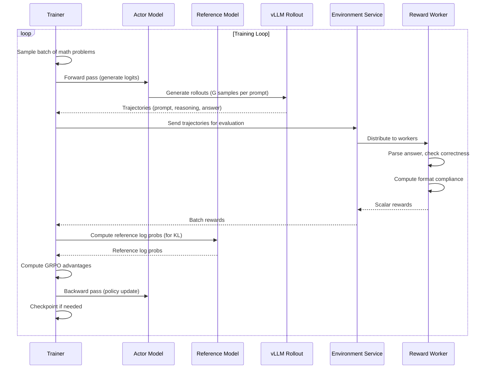

# Design Document: RL Code LLM Training on EKS

## Overview

This design describes a distributed reinforcement learning system for training a Qwen model using Group Relative Policy Optimization (GRPO) via the veRL framework on Amazon EKS. The architecture separates GPU-intensive model training from CPU-based environment/reward computation across dedicated node groups.

### Key Design Decisions

1. **GPU/CPU Separation**: Model training (Trainer/Actor/Reference) runs on g5.48xlarge GPU nodes while environment logic and reward computation runs on c7i.large CPU nodes. This maximizes GPU utilization for model operations.

2. **veRL Framework**: Leverages veRL's distributed RL infrastructure built on Ray, providing FSDP support for model sharding and vLLM integration for efficient inference.

3. **GRPO Algorithm**: Uses Group Relative Policy Optimization which eliminates the need for a critic/value model by computing advantages relative to a group of rollouts, reducing memory and compute overhead.

4. **Remote Environment Service**: The reward computation is exposed as a Kubernetes service, allowing horizontal scaling and fault isolation from the training loop.

5. **Terraform IaC**: All infrastructure is defined declaratively using Terraform modules for reproducibility and version control.

## Architecture

```mermaid
graph TB
    subgraph "EKS Cluster"
        subgraph "GPU Node Group (g5.48xlarge)"
            TR[Trainer Pod]
            AC[Actor/Policy Model]
            RF[Reference Model]
            RO[Rollout Engine - vLLM]
        end
        
        subgraph "CPU Node Group (c7i.large)"
            ENV1[Environment Worker 1]
            ENV2[Environment Worker 2]
            ENVN[Environment Worker N]
            RW[Reward Service]
        end
        
        SVC[Environment K8s Service]
    end
    
    subgraph "AWS Infrastructure"
        VPC[VPC with Private Subnets]
        S3[S3 - Model Checkpoints]
        ECR[ECR - Container Images]
    end
    
    TR --> AC
    TR --> RF
    AC --> RO
    RO -->|Trajectories| SVC
    SVC --> ENV1
    SVC --> ENV2
    SVC --> ENVN
    ENV1 --> RW
    ENV2 --> RW
    ENVN --> RW
    RW -->|Rewards| SVC
    SVC -->|Rewards| TR
    
    TR --> S3
    GPU Node Group --> VPC
    CPU Node Group --> VPC
```

### Data Flow



## Components and Interfaces

### 1. Trainer Component

The central orchestrator running on GPU nodes, responsible for coordinating the GRPO training loop.

```python
class GRPOTrainer:
    """
    Orchestrates the GRPO training loop using veRL's RayPPOTrainer pattern.
    Manages actor, reference model, and communication with environment service.
    """
    
    def __init__(
        self,
        model_name: str,           # e.g., "Qwen/Qwen2.5-1.5B"
        environment_url: str,      # K8s service URL for reward computation
        group_size: int = 8,       # Number of rollouts per prompt (G)
        learning_rate: float = 1e-6,
        kl_coef: float = 0.1,      # β for KL penalty
        clip_range: float = 0.2,   # ε for PPO clipping
        max_grad_norm: float = 1.0,
    ):
        pass
    
    def train_step(self, prompts: List[str]) -> TrainStepMetrics:
        """
        Execute one GRPO training step:
        1. Generate G rollouts per prompt
        2. Send to environment for reward computation
        3. Compute advantages using group normalization
        4. Update policy with clipped objective
        """
        pass
    
    def save_checkpoint(self, path: str) -> None:
        """Save model checkpoint to S3."""
        pass
```

### 2. Actor/Policy Model

The Qwen model being optimized, wrapped with FSDP for distributed training.

```python
class ActorModel:
    """
    Policy model (Qwen) with FSDP sharding for distributed training.
    Handles forward/backward passes and parameter updates.
    """
    
    def __init__(
        self,
        model_path: str,
        fsdp_config: FSDPConfig,
        device_mesh: DeviceMesh,
    ):
        pass
    
    def compute_log_probs(
        self,
        input_ids: torch.Tensor,
        attention_mask: torch.Tensor,
    ) -> torch.Tensor:
        """Compute log probabilities for given sequences."""
        pass
    
    def update_policy(
        self,
        log_probs: torch.Tensor,
        old_log_probs: torch.Tensor,
        advantages: torch.Tensor,
        clip_range: float,
    ) -> PolicyUpdateMetrics:
        """Apply GRPO policy update with clipping."""
        pass
```

### 3. Reference Model

Frozen copy of the initial policy for KL divergence computation.

```python
class ReferenceModel:
    """
    Frozen reference policy for KL divergence computation.
    Uses CPU offload to save GPU memory.
    """
    
    def __init__(
        self,
        model_path: str,
        device_mesh: DeviceMesh,
        cpu_offload: bool = True,
    ):
        pass
    
    def compute_log_probs(
        self,
        input_ids: torch.Tensor,
        attention_mask: torch.Tensor,
    ) -> torch.Tensor:
        """Compute reference log probabilities (no gradients)."""
        pass
```

### 4. Rollout Engine (vLLM)

Efficient inference engine for generating multiple rollouts per prompt.

```python
class RolloutEngine:
    """
    vLLM-based rollout generation for efficient batch inference.
    Generates G samples per prompt for GRPO group comparison.
    """
    
    def __init__(
        self,
        model_path: str,
        tensor_parallel_size: int = 8,  # TP across GPUs
        max_tokens: int = 512,
    ):
        pass
    
    def generate_rollouts(
        self,
        prompts: List[str],
        group_size: int,
        temperature: float = 1.0,
        top_p: float = 1.0,
    ) -> List[Rollout]:
        """
        Generate group_size rollouts per prompt.
        Returns list of Rollout objects with generated text and log probs.
        """
        pass
```

### 5. Environment Service (CPU)

Kubernetes service exposing reward computation to GPU pods.

```python
class EnvironmentService:
    """
    FastAPI service running on CPU nodes.
    Accepts trajectories and returns scalar rewards.
    """
    
    @app.post("/compute_rewards")
    async def compute_rewards(
        self,
        request: RewardRequest,
    ) -> RewardResponse:
        """
        Compute rewards for a batch of trajectories.
        
        Args:
            request: Contains list of (prompt, completion) pairs
            
        Returns:
            RewardResponse with scalar rewards for each trajectory
        """
        pass
```

### 6. Reward Worker

Stateless worker that computes rewards for individual trajectories.

```python
class RewardWorker:
    """
    Computes scalar rewards based on answer correctness and format compliance.
    Runs on CPU nodes, horizontally scalable.
    """
    
    def compute_reward(
        self,
        prompt: str,
        completion: str,
        ground_truth: str,
    ) -> float:
        """
        Compute reward for a single trajectory.
        
        Reward = correctness_score + format_score
        - correctness_score: 1.0 if final answer matches ground truth, 0.0 otherwise
        - format_score: 0.0 to 0.2 based on format compliance
        """
        pass
    
    def extract_answer(self, completion: str) -> Optional[str]:
        """Extract final numeric answer from completion."""
        pass
    
    def check_format(self, completion: str) -> float:
        """Check if completion follows expected format (0.0 to 0.2)."""
        pass
```

### Interface Definitions

```python
from dataclasses import dataclass
from typing import List, Optional

@dataclass
class Rollout:
    """A single generated trajectory."""
    prompt: str
    completion: str
    log_probs: torch.Tensor
    tokens: List[int]

@dataclass
class RewardRequest:
    """Request to compute rewards for trajectories."""
    trajectories: List[Trajectory]
    
@dataclass
class Trajectory:
    """A trajectory to be evaluated."""
    prompt: str
    completion: str
    ground_truth: str

@dataclass
class RewardResponse:
    """Response containing computed rewards."""
    rewards: List[float]
    details: List[RewardDetails]

@dataclass
class RewardDetails:
    """Breakdown of reward computation."""
    correctness_score: float
    format_score: float
    extracted_answer: Optional[str]
    is_correct: bool

@dataclass
class TrainStepMetrics:
    """Metrics from a single training step."""
    policy_loss: float
    kl_divergence: float
    mean_reward: float
    clip_fraction: float
    advantages_mean: float
    advantages_std: float

@dataclass
class PolicyUpdateMetrics:
    """Metrics from policy update."""
    loss: float
    clip_fraction: float
    approx_kl: float
```

## Data Models

### Training Configuration

```python
@dataclass
class TrainingConfig:
    """Configuration for GRPO training."""
    # Model
    model_name: str = "Qwen/Qwen2.5-1.5B"
    
    # GRPO hyperparameters
    group_size: int = 8              # G: rollouts per prompt
    learning_rate: float = 1e-6
    kl_coef: float = 0.1             # β: KL penalty coefficient
    clip_range: float = 0.2          # ε: PPO clip range
    max_grad_norm: float = 1.0
    
    # Training loop
    batch_size: int = 32             # Prompts per batch
    num_epochs: int = 3
    gradient_accumulation_steps: int = 4
    
    # Generation
    max_new_tokens: int = 512
    temperature: float = 1.0
    top_p: float = 1.0
    
    # Infrastructure
    environment_service_url: str = "http://environment-service:8080"
    checkpoint_dir: str = "/checkpoints"  # Local EBS volume
    checkpoint_interval: int = 100   # Steps between checkpoints

@dataclass
class FSDPConfig:
    """FSDP configuration for distributed training."""
    sharding_strategy: str = "FULL_SHARD"
    cpu_offload: bool = False        # For actor (True for reference)
    mixed_precision: str = "bf16"
    reshard_after_forward: bool = True
```

### Dataset Schema

```python
@dataclass
class MathProblem:
    """A math word problem from GSM8K-style dataset."""
    question: str                    # The math problem text
    answer: str                      # Ground truth numeric answer
    solution: Optional[str] = None   # Optional step-by-step solution
    
    def to_prompt(self) -> str:
        """Format as prompt for the model."""
        return f"Solve the following math problem step by step:\n\n{self.question}\n\nSolution:"
```

### Kubernetes Resources

```yaml
# Environment Service Deployment
apiVersion: apps/v1
kind: Deployment
metadata:
  name: environment-service
spec:
  replicas: 4  # Horizontally scalable
  selector:
    matchLabels:
      app: environment-service
  template:
    metadata:
      labels:
        app: environment-service
    spec:
      nodeSelector:
        node-type: cpu  # Run on c7i.large nodes
      containers:
      - name: environment
        image: ${ECR_REPO}/environment:latest
        ports:
        - containerPort: 8080
        resources:
          requests:
            cpu: "2"
            memory: "4Gi"
          limits:
            cpu: "4"
            memory: "8Gi"
---
# Environment Service
apiVersion: v1
kind: Service
metadata:
  name: environment-service
spec:
  selector:
    app: environment-service
  ports:
  - port: 8080
    targetPort: 8080
  type: ClusterIP
```

## Correctness Properties

*A property is a characteristic or behavior that should hold true across all valid executions of a system—essentially, a formal statement about what the system should do. Properties serve as the bridge between human-readable specifications and machine-verifiable correctness guarantees.*

### Property 1: Training Loop Round-Trip

*For any* batch of math problem prompts, the system SHALL:
1. Generate G rollouts per prompt via the actor model
2. Send all trajectories to the environment service
3. Receive scalar rewards for each trajectory
4. Compute GRPO advantages using group normalization
5. Apply policy updates to the actor model

The number of rewards received MUST equal the number of trajectories sent (batch_size × group_size).

**Validates: Requirements 2.4, 2.5, 2.6, 7.1, 7.2, 7.3, 7.4, 7.5**

### Property 2: Reward Determinism

*For any* trajectory (prompt, completion, ground_truth) tuple, calling the reward computation function multiple times SHALL produce identical scalar reward values.

```
∀ trajectory t: reward(t) == reward(t)  # Idempotent
```

**Validates: Requirements 5.4**

### Property 3: Reward Correctness

*For any* completion containing a final numeric answer:
- If the extracted answer equals the ground truth, correctness_score SHALL be 1.0
- If the extracted answer does not equal the ground truth, correctness_score SHALL be 0.0
- The total reward SHALL be correctness_score + format_score where 0.0 ≤ format_score ≤ 0.2

```
∀ completion c, ground_truth g:
  extract_answer(c) == g → correctness_score(c, g) == 1.0
  extract_answer(c) != g → correctness_score(c, g) == 0.0
  0.0 ≤ total_reward(c, g) ≤ 1.2
```

**Validates: Requirements 5.1, 5.2, 5.3**

### Property 4: Environment Service Contract

*For any* valid RewardRequest containing N trajectories:
- The environment service SHALL accept the request
- The environment service SHALL return a RewardResponse with exactly N rewards
- The response time SHALL be bounded (< timeout threshold)

```
∀ request r with len(r.trajectories) == N:
  response = environment_service(r)
  len(response.rewards) == N
  response_time < TIMEOUT_MS
```

**Validates: Requirements 3.2, 3.3, 3.5**

### Property 5: GRPO Advantage Normalization

*For any* group of G rollouts for a single prompt with rewards [r₁, r₂, ..., r_G]:
- The computed advantages SHALL have mean ≈ 0 (within floating point tolerance)
- The computed advantages SHALL have std ≈ 1 (within floating point tolerance)

```
∀ rewards R = [r₁, ..., r_G]:
  advantages A = [(rᵢ - mean(R)) / std(R) for rᵢ in R]
  |mean(A)| < ε
  |std(A) - 1| < ε
```

**Validates: Requirements 2.6, 7.5**

### Property 6: Node Placement Invariant

*For any* pod in the training deployment:
- Trainer/Actor/Reference pods SHALL be scheduled on nodes with label `node-type: gpu`
- Environment/Reward pods SHALL be scheduled on nodes with label `node-type: cpu`

```
∀ pod p:
  p.type ∈ {trainer, actor, reference} → p.node.label["node-type"] == "gpu"
  p.type ∈ {environment, reward} → p.node.label["node-type"] == "cpu"
```

**Validates: Requirements 2.1, 3.1, 6.4, 6.5**

## Error Handling

### GPU-Side Error Handling

| Error Type | Handling Strategy | Recovery Action |
|------------|-------------------|-----------------|
| OOM during forward pass | Reduce batch size dynamically | Retry with smaller batch |
| Environment service timeout | Retry with exponential backoff | Skip batch after max retries |
| Environment service unavailable | Queue requests, wait for recovery | Pause training, alert |
| Checkpoint save failure | Retry to S3 | Continue training, retry later |
| NaN in gradients | Skip batch, log warning | Continue with next batch |

### CPU-Side Error Handling

| Error Type | Handling Strategy | Recovery Action |
|------------|-------------------|-----------------|
| Invalid trajectory format | Return error response | Log and return 0.0 reward |
| Answer extraction failure | Return partial reward | Return format_score only |
| Worker crash | K8s restarts pod | Request retried to healthy pod |
| Resource exhaustion | HPA scales up | Queue requests until scaled |

### Retry Policy

```python
@dataclass
class RetryConfig:
    """Configuration for retry behavior."""
    max_retries: int = 3
    initial_backoff_ms: int = 100
    max_backoff_ms: int = 5000
    backoff_multiplier: float = 2.0
    
    # For environment service calls
    timeout_ms: int = 30000
    
    # Behavior on persistent failure
    skip_on_failure: bool = True  # Skip batch vs crash training
```

## Testing Strategy

### Unit Tests

Unit tests verify specific examples and edge cases:

1. **Reward Computation**
   - Test correct answer extraction from various formats
   - Test format compliance scoring
   - Test edge cases: empty completion, no answer, malformed output

2. **GRPO Advantage Calculation**
   - Test normalization with known reward distributions
   - Test edge case: all rewards identical (std = 0)
   - Test numerical stability with extreme values

3. **Trajectory Parsing**
   - Test extraction of reasoning steps
   - Test handling of special characters
   - Test truncation behavior

### Property-Based Tests

Property-based tests verify universal properties across randomly generated inputs. Each test MUST run minimum 100 iterations.

**Test Configuration:**
- Framework: `hypothesis` (Python) or `fast-check` (TypeScript)
- Minimum iterations: 100 per property
- Seed: Fixed for reproducibility in CI

**Property Test Specifications:**

1. **Feature: rl-code-llm-training, Property 1: Training Loop Round-Trip**
   - Generate random batches of prompts
   - Verify trajectory count equals batch_size × group_size
   - Verify reward count equals trajectory count

2. **Feature: rl-code-llm-training, Property 2: Reward Determinism**
   - Generate random trajectories
   - Call reward function twice
   - Assert identical results

3. **Feature: rl-code-llm-training, Property 3: Reward Correctness**
   - Generate random completions with known answers
   - Verify correctness_score is binary (0.0 or 1.0)
   - Verify total reward is in valid range [0.0, 1.2]

4. **Feature: rl-code-llm-training, Property 4: Environment Service Contract**
   - Generate random RewardRequests
   - Verify response length matches request length
   - Verify response time is bounded

5. **Feature: rl-code-llm-training, Property 5: GRPO Advantage Normalization**
   - Generate random reward groups
   - Verify normalized advantages have mean ≈ 0, std ≈ 1

### Integration Tests

1. **End-to-End Training Step**
   - Deploy minimal cluster (1 GPU node, 1 CPU node)
   - Execute single training step
   - Verify model weights updated

2. **Environment Service Scaling**
   - Start with 1 environment worker
   - Scale to 4 workers
   - Verify training continues without interruption

3. **Fault Tolerance**
   - Kill environment worker during request
   - Verify retry succeeds
   - Verify training continues

### Infrastructure Tests

1. **Terraform Validation**
   - `terraform validate` passes
   - `terraform plan` shows expected resources
   - No security group misconfigurations

2. **Network Connectivity**
   - GPU pod can reach environment service
   - DNS resolution works
   - No unexpected egress

## Terraform Infrastructure Design

### Module Structure

```
terraform/
├── environments/
│   └── dev/
│       ├── main.tf
│       ├── variables.tf
│       ├── outputs.tf
│       └── terraform.tfvars
├── modules/
│   ├── vpc/
│   │   ├── main.tf
│   │   ├── variables.tf
│   │   └── outputs.tf
│   ├── eks/
│   │   ├── main.tf
│   │   ├── variables.tf
│   │   └── outputs.tf
│   └── node-groups/
│       ├── main.tf
│       ├── variables.tf
│       └── outputs.tf
└── backend.tf
```

### Key Resources

```hcl
# VPC Module outputs
output "vpc_id" { }
output "private_subnet_ids" { }
output "public_subnet_ids" { }

# EKS Module outputs  
output "cluster_endpoint" { }
output "cluster_certificate_authority" { }
output "cluster_name" { }

# Node Groups Module outputs
output "gpu_node_group_arn" { }
output "cpu_node_group_arn" { }
```

### Tagging Strategy

```hcl
locals {
  common_tags = {
    Project     = "rl-code-llm-training"
    Environment = var.environment
    ManagedBy   = "terraform"
    Team        = "ml-platform"
  }
}
```
