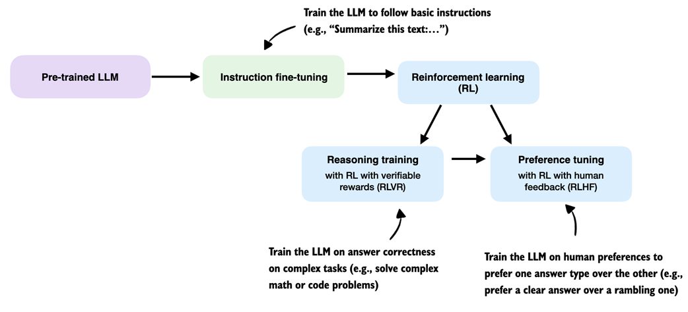
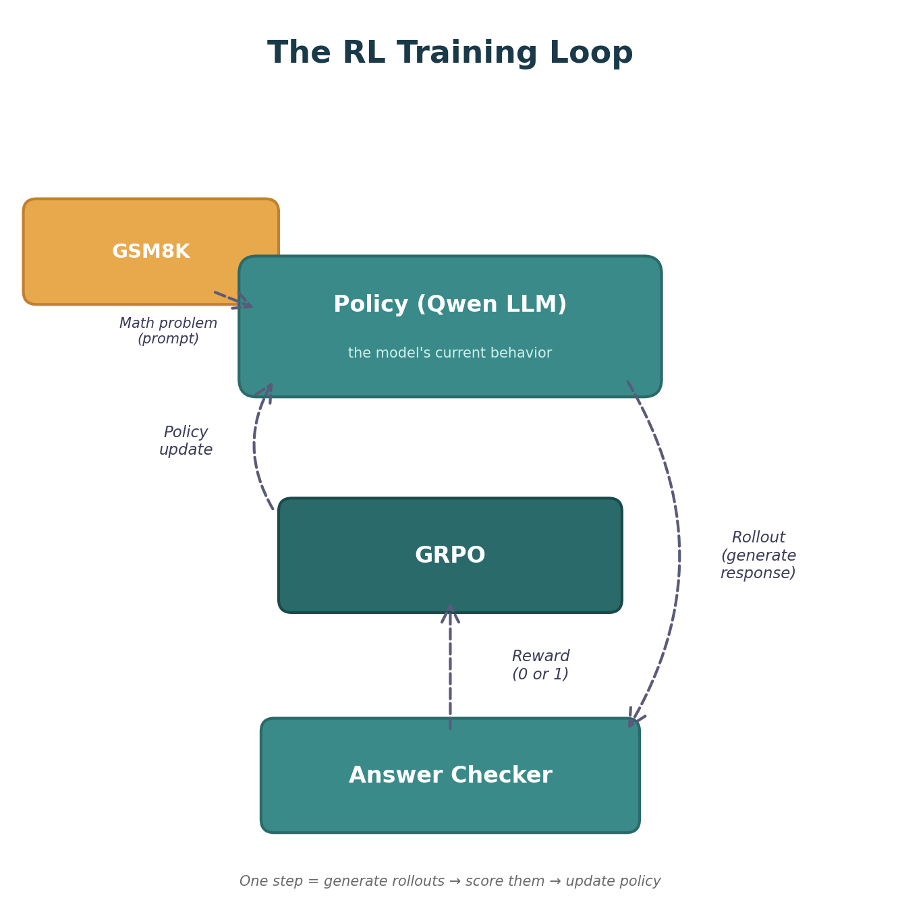
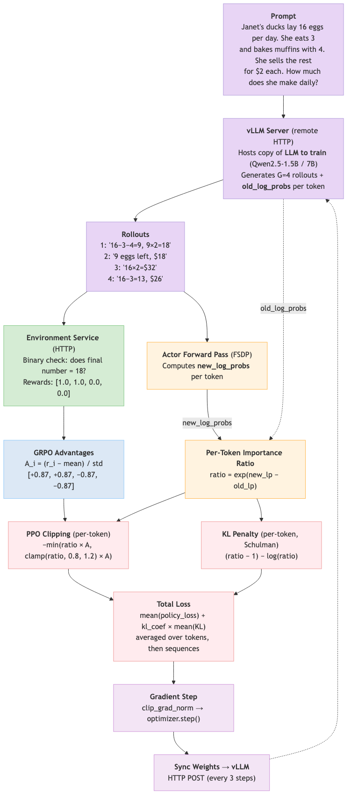
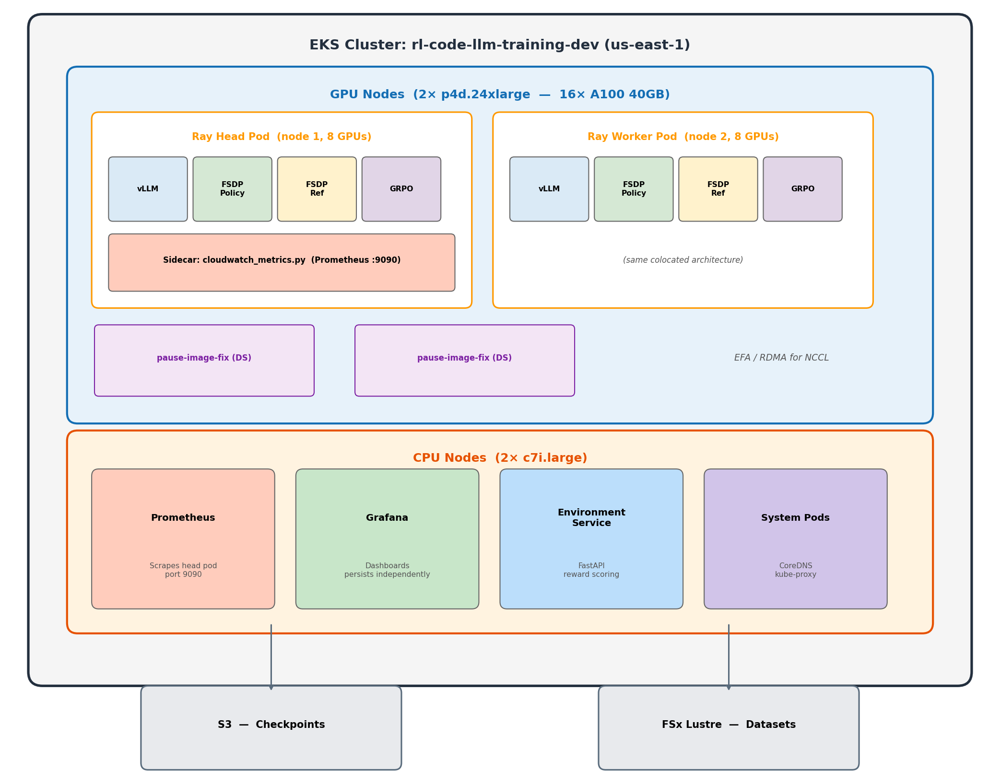
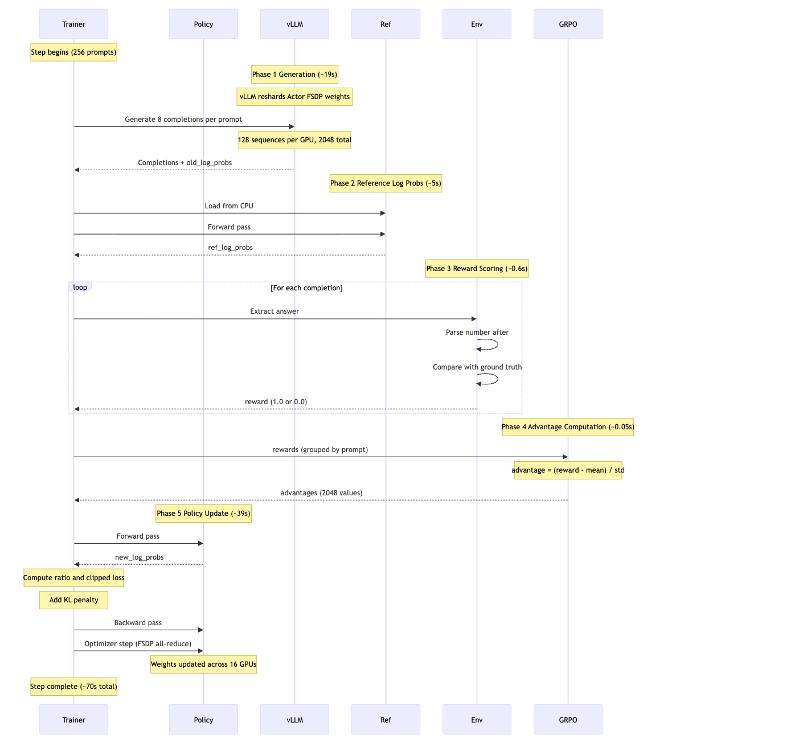
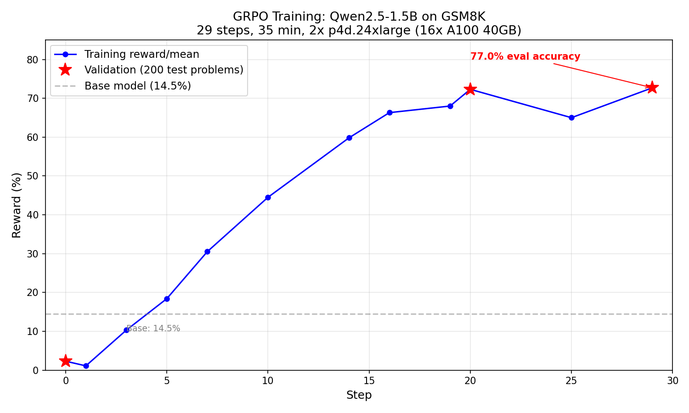
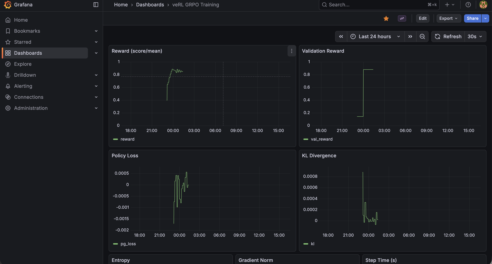

# The Punchline

A QWEN 1.5B parameter model with **14.5% base accuracy** → **77% accuracy** after just 35 minutes of RL training.

A QWEN 7B model → **88% accuracy** in 83 minutes.

No human-written solutions. Just a binary signal: *right or wrong*.

::: notes
This is the headline result. We took small language models that could barely do grade-school math and trained them using reinforcement learning with the simplest possible reward — did you get the right number? Yes or no. No step-by-step solutions, no human feedback, no learned reward model. The rest of this talk is about how we got here — the algorithm, the infrastructure, the bugs, and what we learned along the way.
:::

# What is Reinforcement Learning?

- **Reinforcement learning**: here's the question, try something, I'll tell you if it worked — figure out how to get it right
- The model explores on its own, gets a reward signal (right/wrong), and gradually improves. No hand-crafted solutions needed — just a way to check the answer.
- **Supervised learning**: here's the question, here's the correct answer — learn to copy it

::: notes
Think of it like teaching someone to cook. Supervised learning gives them a recipe to follow step by step. RL just lets them taste the result and says "good" or "bad" — they figure out the recipe themselves. This is powerful because the model can discover strategies that humans might not think of.
:::

# Where RL Fits in LLM Training



- **Instruction fine-tuning** teaches the model to follow instructions ("Summarize this text...")
- **RL with verifiable rewards (RLVR)** trains on answer correctness — math, code, factual questions
- **RL with human feedback (RLHF)** trains on human preferences — clarity, safety, tone

Our work lives in the **RLVR** box: binary reward (right/wrong answer), no human feedback needed.

::: notes
This diagram shows where reinforcement learning fits in the modern LLM training pipeline. You start with a pre-trained model, fine-tune it to follow instructions, then apply RL. There are two main flavors of RL: RLVR uses verifiable rewards — did you get the math problem right? — while RLHF uses human preferences — is this response helpful and safe? Our GRPO training on GSM8K is squarely in the RLVR category. We have a ground truth answer we can check against, so we don't need human annotators or a learned reward model.
:::

# The Goal

Train Qwen2.5-1.5B / 7B on GSM8K math reasoning using **GRPO** (DeepSeek-R1).

- **Dataset**: GSM8K — 7,473 train / 1,319 test, binary reward (correct = 1.0)
- **Infrastructure**: EKS, 2× p4d.24xlarge (16× A100 40GB)
- **Two approaches**: Hand-rolled GRPO trainer (learning exercise) → veRL framework (production)

::: notes
GSM8K is grade-school math — 2 to 8 step arithmetic problems. Simple enough that a small model sometimes gets them right, hard enough that the base model gets 85% wrong. Binary reward means we just check if the final number is correct. We ran on 16 A100 GPUs across 2 nodes on EKS. We tried building our own trainer first to learn how GRPO works, then switched to veRL for the real training.
:::

# GRPO Setup

**GSM8K example:**

**Q:** Janet's ducks lay 16 eggs per day. She eats three for breakfast and bakes muffins with four. She sells the rest for $2 each. How much does she make daily?

**A:** 16 - 3 - 4 = 9 eggs. 9 × $2 = $18. **#### 18** — we only use this final number


::: notes
This is a real example from GSM8K. The dataset has step-by-step solutions with calculator annotations, but we throw all of that away. We only extract the number after the #### marker and use it as the ground truth for the binary reward. The model never sees the solution text — it has to discover its own reasoning.
:::

# Key RL Concepts (1/3)

{ width=45% }

- **Policy** — the model's current behavior — given a question, how it decides what to write. Training changes the policy to produce better answers.
- **Reward** — the score for a rollout. In our case, binary: 1 if the final number is correct, 0 if not. This is the only feedback the model gets.
- **Rollout** — one complete attempt at answering a question. In GRPO we generate a *group* of rollouts per prompt (e.g. 8) so we can compare them.
- **Step** — one full training cycle: generate rollouts → score them → update the policy.

::: notes
These are the foundational terms for the rest of the talk. Policy is just the model's behavior — its current strategy for answering questions. When we say "update the policy," we mean adjusting the model's weights so it behaves differently next time. Reward is the signal that tells the model how it did — in our case, did you get the right number? Yes = 1, no = 0. No partial credit, no style points. A rollout is one attempt — the model reads the question and writes out a complete answer. We generate multiple rollouts per prompt (a "group") so we have something to compare. A step is one complete loop through the pipeline: generate a batch of rollouts, score them, compute the loss, update the weights. When we say "the model converged in 29 steps," each step processed 2,048 rollouts and took about 70 seconds.
:::

# Key RL Concepts (2/3)

- **Log Probs** — the model's confidence score for each token it generates. Close to 0 = very confident, large negative (like -10) = uncertain. We track these to measure how the model's behavior changes during training.
- **Advantage** — "how much better was this attempt vs what I expected?" Positive = reinforce, negative = discourage, zero = learn nothing. Turns raw reward into a training signal.

::: notes
These six concepts are the building blocks of both PPO and GRPO — you need to understand them before comparing the two algorithms. This slide covers log probs and advantage.

Log probs: Think of these as the model's receipt for every decision it made. When the model writes "The answer is 42", it chose one token at a time — "The", then "answer", then "is", then "42" — each with a confidence level. We only find out *after* the full answer whether it was right or wrong. So we need to go backwards and figure out which choices to reinforce. It's like a chef who cooks without tasting — they add salt, pepper, garlic, each a separate decision. A food critic tries the dish and says "great!" Now the chef needs to remember: what did I add, and how much? That memory is the log probs. Without it, the chef knows "the dish was good" but can't learn *which decisions* made it good. Log probs let the training algorithm say: answer was correct → increase the probability of those token choices. Answer was wrong → decrease them.

When the model generates the token "18", it internally assigns a probability — say 0.73. The log prob is ln(0.73) = -0.31. If it's unsure and assigns 0.001, the log prob is -6.9. Why use log instead of raw probabilities? Two reasons. First, a sequence of 200 tokens has a joint probability that's the product of all individual token probabilities — something like 0.7 × 0.3 × 0.9 × ... which quickly becomes a tiny number like 10^-80 that computers can't represent. In log space, multiplication becomes addition: -0.36 + -1.2 + -0.1 + ... which stays in a normal numeric range. Second, the math of gradient descent works more naturally with logs — the policy gradient formula is literally defined in terms of log probabilities.

We compare log probs from before and after a training update to compute the "importance ratio" — how much more or less likely is this token now? A ratio of 1.0 means unchanged, 1.5 means 50% more likely, 0.5 means half as likely.

Advantage: Raw rewards are just 0 or 1 — right or wrong. But the model needs to know "was this answer good relative to what I usually do?" That's the advantage. If the model gets 6 out of 8 right, the correct answers have a small positive advantage (slightly above average) and the wrong ones have a larger negative advantage. If it only gets 1 out of 8 right, that one gets a huge positive advantage — it's the rare success the model should learn from.
:::

# Key RL Concepts (3/3)

- **Clipping** — a safety rail on updates. Limits how much the model can change in one step. Without it, one lucky answer could swing the model so hard it forgets everything else.
- **KL Penalty** — measures how far the model has drifted from its starting point. Small penalty each step prevents the model from wandering too far and collapsing into repetitive or degenerate outputs.

::: notes
Clipping: The importance ratio tells us how much the policy changed. Clipping caps this ratio to a range like [0.8, 1.2]. Say the model discovers that starting with "Let me think step by step" helps — without clipping, it might crank that probability from 10% to 95% in one step, destabilizing everything else. Clipping forces gradual change: 10% → 12% → 14.4%, giving the model time to adapt.

KL penalty: Clipping limits each individual step, but the model can still drift far over many steps — like walking slowly but in the wrong direction for hours. KL divergence measures the total distance from the starting policy. Adding a small KL penalty to the loss function acts like a rubber band pulling the model back toward its original behavior. Too much KL penalty and the model never learns; too little and it collapses.
:::

# PPO vs GRPO

| | PPO | GRPO |
|---|---|---|
| **Baseline** | Learned critic (value network) | Group average of rewards |
| **Extra model** | Yes — train a separate value network | No — just compare rollouts to each other |
| **Advantage** | GAE from critic predictions | `(reward_i - mean) / std` within group |
| **Memory** | 2× model memory (actor + critic) | 1× model memory |
| **Rollouts** | 1 per prompt | G per prompt (e.g. 8) — need group for comparison |
| **Clipping** | Yes (clip ratio) | Yes (same PPO-style clipping) |
| **KL penalty** | Optional | Yes — prevents drift from reference policy |
| **Complexity** | Higher — critic has its own loss, learning rate, architecture | Lower — no critic to tune or debug |

::: notes
This is the key algorithmic difference between PPO and GRPO. In standard PPO, you train a separate neural network — the critic — that learns to predict "how good is this state?" That prediction becomes your baseline for computing advantages. The problem: the critic is itself a large model that needs training, doubles your GPU memory, and can be a source of instability if it learns a bad value estimate.

GRPO — Group Relative Policy Optimization from DeepSeek — throws out the critic entirely. Instead, for each prompt you generate a group of completions (say 8), score them all, and compute each one's advantage relative to the group: (reward minus mean) divided by standard deviation. If 3 out of 8 got the right answer, those 3 get positive advantages and the 5 wrong ones get negative advantages. If all 8 got it right or all wrong, the advantage is zero and the model learns nothing from that prompt — which is exactly correct.

Both algorithms use PPO-style clipping to limit how much the policy can change per step. GRPO adds a KL penalty to prevent long-term drift from the reference policy. The practical win is simplicity and memory: no critic to architect, tune, or debug, and you save 50% of GPU memory that would have gone to the value network. The tradeoff is you need multiple rollouts per prompt (we use 8), which costs more inference compute. For tasks with verifiable rewards like math — where checking the answer is free — GRPO is a clear win.
:::

# GRPO — Custom Trainer Data Flow

{ width=100% }

::: notes
This diagram maps the concepts from the previous slides onto our actual implementation. The prompt goes to the LLM, which generates 4 rollouts (group size 8 each) via a remote vLLM server. The environment service checks the final number and returns binary rewards (0 or 1). The trainer then computes log probs, advantages, clipped ratios, and KL penalty — all per-token as discussed earlier — and performs the gradient update. After the gradient step, weights sync back to vLLM every 3 steps via HTTP — a 22-second serialization of 3GB that became our biggest bottleneck.

The key architectural constraint: vLLM runs in a separate process with its own CUDA context, so it can't join the trainer's NCCL process group. HTTP was the only communication path. We skip the frozen reference model to save GPU memory and instead use old_log_probs from generation time as the KL reference — a pragmatic tradeoff that works when the policy changes slowly between steps.

Our naive KL estimator — max(0, log(new/old)) — gave zero signal for 99% of steps because at low learning rates the log ratio is a tiny negative number that gets clamped away. Switching to the Schulman estimator — (ratio - 1) - log(ratio) — fixed this: it's always non-negative and catches drift in both directions without clamping.
:::

# Experiment 1: Custom Trainer — The Journey

{ width=100% }

::: notes
This is the architecture we built from scratch. The vLLM server runs on its own GPU and generates completions via HTTP. The trainer pods run FSDP across 14 GPUs on 2 nodes. The environment service on a CPU node checks if answers are correct. The awkward part is the weight sync — every 3 steps, rank 0 has to serialize 3GB of weights and POST them to the vLLM server over HTTP. That takes 22 seconds each time. Why HTTP and not RDMA/NCCL? Because vLLM runs in a separate process with its own CUDA context — it can't join the trainer's NCCL process group without deadlocking. We tried running vLLM inside torchrun and it hung on initialization because both vLLM and FSDP fight over NCCL. So the only way to communicate was through the network stack — HTTP was the simplest option. This is the fundamental bottleneck that veRL solves by colocating everything in the same process and doing zero-copy weight resharding. An alternative we didn't try: torchrun with nproc_per_node=7 on node 1 (leaving GPU 0 free for vLLM) and nproc_per_node=8 on node 2. This works because torchrun's c10d rendezvous backend — a TCP key-value store on the master node — handles asymmetric process counts. Each node registers however many processes it launched, and once all check in, ranks are assigned. With this setup, GPU 0 is completely outside the NCCL group, so no deadlock. Weight sync could then use shared memory or cudaIpcMemHandle (same-node GPU-to-GPU memory sharing) instead of HTTP — cutting 22 seconds down to 1-2 seconds. We jumped straight to separate pods which forced us into HTTP.
:::

# Attempt 1: OOM Immediately

- batch_size=8, group_size=8 → 64 sequences/step
- Rank 0 holds FSDP shard + full generation model
- **Crashed on step 1** — GPU 0 out of memory

Fix: Reduce batch_size to 4.

::: notes
Our first attempt was too ambitious with batch size. With 8 prompts times 8 completions, that's 64 sequences per step. GPU 0 was especially constrained because it holds both its FSDP shard and the full generation model for producing completions. Dropping to batch_size=4 gave us 32 sequences per step and fit in memory.
:::

# Attempt 2: KL Explosion

**Root cause**: Computing importance ratio on sequence-level summed log probs — `exp(sum of 200 token shifts)` → exponential blowup.

| Step | KL Divergence |
|------|--------------|
| 1 | 0.42 |
| 2 | **194.8** 💥 |
| 3 | OOM crash |

::: notes
This was the most instructive bug. KL went from 0.42 to 194.8 in a single step, then the model diverged so badly it OOM'd from NaN activations. The root cause: we were summing log probabilities across the entire sequence (200+ tokens) and then taking exp() of the difference. Even tiny per-token shifts of 0.01 accumulate into a sum of 2.0, and exp(2) = 7.4. After one gradient step with that inflated ratio, the next step gets exp(50) which is astronomical. The DeepSeek paper is clear that the importance ratio is a per-token concept.
:::

# Attempt 2: The Fix

Per-token importance ratio instead of sequence-level:

```
Broken (sequence-level):
ratio = exp(-448 - (-450)) = exp(2.0) = 7.4  ← unstable

Fixed (per-token):
ratio = exp(0.01) = 1.01  ← stable
```

After fix: KL stayed at 0.0004–0.0009 ✓

::: notes
The fix is straightforward — compute the importance ratio per token, apply clipping per token, then average. This keeps every individual ratio close to 1.0 and within the clip range of 0.8 to 1.2. We verified numerically: with 200 tokens and per-token shifts of 0.02 standard deviation, the old method gives ratio=1.46 and KL=0.08, while the new method gives mean ratio=1.002 and KL=0.0002. Night and day difference.
:::

# Attempt 3: Too Slow

- Per-token fix worked — KL stable, no OOM
- But: **5 min/step**, 12 steps/hr
- 1,868 total steps → **156 hours** for 1 epoch
- Capacity block: 32 hours

Problem: 32 sequential HuggingFace `model.generate()` calls per step (one per rollout, no batching).

::: notes
The math fix worked perfectly but exposed a performance problem. Each step made 32 separate generate calls, each triggering an FSDP all-gather across 14 GPUs. At 5 minutes per step and 1,868 steps for one epoch, we'd need 156 hours. Our GPU capacity block was only 32 hours. We needed at least a 5x speedup.
:::

# Attempt 4: Batched Generation

Used `num_return_sequences=8` in HuggingFace `model.generate()` — generates all 8 completions per prompt in one call, sharing the KV cache.

4 generate calls instead of 32 → **3× speedup**.

| | Before | After |
|---|---|---|
| Step time | 5 min | 1.5 min |
| Steps/hr | 12 | 40 |
| 1 epoch | 156 hours | 47 hours |

::: notes
The key insight was that HuggingFace generate supports num_return_sequences — you give it one prompt and it generates 8 completions in a single forward pass, sharing the KV cache for the prompt tokens. This reduced 32 generate calls to 4 (one per prompt in the batch). 3x speedup to 1.5 minutes per step. Still not fast enough for a full epoch in our time window, but the reward was starting to trend upward — we could see the model learning.
:::

# Attempt 5: vLLM Server

Deployed vLLM as separate K8s pod with HTTP weight sync. **Crashed at step 50** — checkpoint save bug (`local_rank` vs `global_rank`).

| | HF Batched | vLLM Server |
|---|---|---|
| Step time | 1.5 min | 50s |
| Steps/hr | 40 | 72 |
| 1 epoch | 47 hours | 26 hours |

::: notes
vLLM is much faster than HuggingFace generate for inference — it uses PagedAttention and continuous batching. But we couldn't run it inside torchrun because it conflicts with NCCL. So we deployed it as a separate Kubernetes pod and communicated via HTTP. Got down to 50 seconds per step. But it crashed at step 50 due to a checkpoint bug — we used local_rank instead of global_rank to decide who saves, so on multi-node, node 2's local rank 0 tried to save an empty state dict. Even before the crash, reward was oscillating without a clear trend because 32 sequences per step is just too noisy for stable learning.
:::

# Custom Trainer: Speed Evolution

6× faster over 3 iterations — but still not enough.

| Attempt | Method | Step Time | Steps/hr |
|---------|--------|-----------|----------|
| 3 | Sequential `model.generate()` | 5 min | 12 |
| 4 | Batched `num_return_sequences=8` | 1.5 min | 40 |
| 5 | vLLM separate pod, HTTP API | 63s | 57 |
| 5+ | vLLM + batched log_probs | 50s | 72 |

::: notes
We got a 6x speedup through three rounds of optimization. But even at 72 steps per hour with only 32 sequences per step, the effective throughput was 2,304 sequences per hour. The fundamental problem wasn't speed per step — it was that we could only fit 4 prompts per batch due to memory constraints in our hand-rolled code. veRL solves this by properly managing GPU memory across phases.
:::

# Experiment 2: veRL Framework

Switched to veRL (ByteDance) — production RL post-training framework.

{ width=100% }

::: notes
After 12 hours of debugging the custom trainer, we switched to veRL. The architecture is fundamentally different — every GPU runs all roles by cycling through phases. No separate vLLM pod, no HTTP weight sync, no memory fragmentation from dedicated roles. veRL manages GPU memory by loading and unloading models between phases. The ref model lives on CPU and only comes to GPU briefly for log prob computation. How does veRL avoid the NCCL deadlock we hit? It doesn't run vLLM and FSDP simultaneously — it time-shares the same GPUs. During generation, the FSDP actor is offloaded and vLLM takes over. During training, vLLM's KV cache is freed and FSDP loads back. The WorkerDict abstraction holds both engines on each GPU and orchestrates turns. Weight resharding between FSDP's sharded layout and vLLM's tensor-parallel layout happens via DTensor — a metadata operation that remaps how the same physical memory is viewed, not an actual data copy. So veRL didn't solve the NCCL conflict — it avoided it entirely by never running both at the same time.
:::

# veRL Architecture

Every GPU runs all roles by cycling through phases:

{ width=100% }

::: notes
Each step takes about 70 seconds for 2,048 sequences. Generation is 19 seconds using vLLM engines on all 16 GPUs in parallel. The actor update dominates at 39 seconds — that's the FSDP training forward and backward pass. Ref log probs take 5 seconds — the ref model is offloaded to CPU between steps and loaded back for this phase. Reward is trivial at 0.6 seconds — just CPU string matching. The key insight is zero-copy weight resharding between the FSDP actor and the vLLM engine — no serialization or network transfer needed.
:::

# veRL: 1.5B Results

{ width=100% }

::: notes
This is the training curve for Qwen2.5-1.5B. Reward climbs steadily from near zero to about 65-70% over 29 steps. The validation reward at step 20 was 72.3% and at step 29 was 72.7% — the model had essentially converged. Total training time was 35 minutes for one full epoch of GSM8K. Compare this to the custom trainer which couldn't even finish one epoch in 26 hours.
:::

# veRL: 1.5B Results (cont.)

29 steps, 35 minutes, 1 full epoch. Eval: Base 14.5% → GRPO-trained **77.0%**

| Step | Reward | KL |
|------|--------|-----|
| 0 (val) | 14.5% | — |
| 10 | 44.5% | — |
| 20 (val) | 72.3% | — |
| 29 (val) | **72.7%** | — |

::: notes
The eval was done on 200 random test problems with greedy decoding using the same chat template as training. Base model gets 14.5% with the chat template. After GRPO training, it scores 77% — the model learned both the format and improved its reasoning. KL stayed very low throughout — 0.0007 at step 3, never spiking. veRL's implementation is rock solid.
:::

# veRL: 7B Results

14.3% → **88.0%** in 10 steps (~83 min). Saturated by step 9.

| Step | Reward |
|------|--------|
| 0 (val) | 14.3% |
| 9 | 88.8% |
| 10 (val) | **88.0%** |

::: notes
The 7B model is dramatically faster at learning. It went from 14.3% to 88% validation accuracy in just 10 steps — about 83 minutes of training. By step 9 it was already at 88.8% training reward and essentially saturated. The remaining steps from 10 to 19 just oscillated between 83 and 88%. Unfortunately our GPU capacity block expired after step 19, one step before the checkpoint save at step 20. We've since changed the save frequency to every 10 steps. Each step takes about 502 seconds — 7x slower than 1.5B because the model is bigger and we had to halve the batch size to fit in memory.
:::

# 7B vs 1.5B Learning Curves

7B learns **faster** (fewer steps) and reaches a **higher ceiling**, but each step takes 7× longer.

| | 1.5B | 7B |
|---|---|---|
| Base accuracy | 14.5% | 14.3% |
| Peak validation | 77.0% (step 29) | **88.0%** (step 10) |
| Steps to 70%+ | ~20 | ~7 |
| Step time | 70s | 502s |

::: notes
The 1.5B starts at 14.5% and the 7B at 14.3% baseline accuracy. The 7B model reaches 70% in just 7 steps versus 20 for the 1.5B, and peaks at 88% versus 77%. The larger model has more capacity to represent complex reasoning patterns. The tradeoff is wall-clock time per step — 502 seconds versus 70 seconds — because the 7B model needs more memory (halving the batch size) and more compute for forward and backward passes. In total wall-clock time, the 7B took about 83 minutes to reach 88% while the 1.5B took 35 minutes to reach 77%.
:::

# Two Approaches

Built custom trainer first to learn GRPO internals, then switched to veRL for production.

| | Custom Trainer | veRL Framework |
|---|---|---|
| Code | ~800 lines, hand-rolled | ~50 lines config |
| Debug time | 12 hours, 5 attempts | Worked first try |
| Throughput | 2,304 seq/hr | 104,448 seq/hr |
| 1 epoch | ~26 hours | **35 minutes** |

::: notes
The custom trainer was a learning exercise — we wanted to understand every piece of the GRPO pipeline: how importance ratios work, how KL penalties interact with clipping, how to manage FSDP weights with vLLM. It took 5 attempts and 12 hours of debugging. veRL by ByteDance is a production framework that handles all of this out of the box. The throughput difference is 45x — mostly from colocated vLLM and much larger batch sizes.
:::

# Infrastructure

| Component | Details |
|-----------|---------|
| EKS Cluster | rl-code-llm-training-dev (us-east-1, EKS 1.29) |
| GPU Nodes | 2× p4d.24xlarge (8× A100 40GB each) |
| CPU Nodes | 2× AL2023_x86_64_STANDARD |
| Orchestration | KubeRay v1.3.0 (Terraform-managed) |
| Framework | veRL 0.6.1 + vLLM 0.8.4 |
| Storage | S3 for checkpoints |
| Monitoring | Prometheus + Grafana |
| IaC | Terraform for everything |

::: notes
Everything runs on EKS in us-east-1. The GPU nodes are p4d.24xlarge instances with 8 A100 40GB GPUs each, connected via EFA for fast NCCL communication. We use capacity blocks for the GPU instances since they're expensive — about $32/hr per node. CPU nodes run the monitoring stack and environment service. KubeRay manages the Ray cluster for veRL. All infrastructure is Terraform-managed — no manual kubectl or console changes for persistent resources.
:::

# Ray Cluster & Kubernetes Config

| Resource | Details |
|----------|---------|
| **RayCluster** | `verl-grpo` — head + 1 worker, Ray 2.44.1 |
| **Head node** | 8 GPUs, 48 CPU, 600Gi memory, metrics sidecar on port 9090 |
| **Worker node** | 8 GPUs, 48 CPU, 600Gi memory (identical to head) |
| **Shared memory** | 200Gi `/dev/shm` per pod (NCCL inter-GPU comms) |
| **Training script** | ConfigMap-mounted `run_grpo.sh` — all hyperparams via env vars |
| **Storage** | gp3 StorageClass (EBS CSI), FSx Lustre for shared data |
| **Networking** | EFA for RDMA between nodes, NCCL for GPU-to-GPU |
| **Security** | IRSA — pod-level IAM for S3 checkpoints + CloudWatch |

::: notes
The Ray cluster is managed by KubeRay v1.3.0 deployed via Helm. The head and worker pods are identical — each gets a full p4d.24xlarge with 8 GPUs. The 200Gi shared memory emptyDir is critical — NCCL uses /dev/shm for inter-GPU communication within a node, and the default 64MB Kubernetes limit would cause silent failures.

All training configuration lives in a ConfigMap: model name, batch size, learning rate, KL coefficient, clip range — everything is an environment variable, so we can change hyperparameters without rebuilding images. The `run_grpo.sh` script reads these and launches veRL with the right flags.

For storage, we use two tiers: FSx for Lustre provides high-throughput shared storage for the dataset (ReadWriteMany across pods), while S3 stores checkpoints via IRSA — the pod assumes an IAM role that grants PutObject/GetObject on the checkpoint bucket, no AWS credentials baked into the image.

EFA (Elastic Fabric Adapter) gives us 400 Gbps RDMA between the two GPU nodes — this is what makes NCCL all-reduce fast enough for distributed training. Without EFA, FSDP weight syncs over standard TCP would be a bottleneck. The Terraform module conditionally provisions 4 EFA interfaces per node and a security group that allows all traffic between EFA-enabled nodes.

The NVIDIA device plugin runs as a DaemonSet on GPU nodes, exposing GPUs to the Kubernetes scheduler. Each pod requests `nvidia.com/gpu: 8` and the nodes are tainted with `nvidia.com/gpu=true:NoSchedule` so only GPU workloads land there.
:::

# Observability

Prometheus + Grafana on CPU nodes, persisting independently of GPU pods.

**Metrics tracked**: Reward, KL divergence, policy loss, entropy, gradient norm, step time, GPU memory, throughput, validation reward.

Sidecar script on head pod tails veRL logs → exposes via `prometheus_client` → PodMonitor scrapes → Grafana dashboard auto-provisioned via ConfigMap.

::: notes
Observability was critical — GPU training pods are ephemeral and expensive, so we needed metrics to persist independently. A sidecar Python script on the Ray head pod parses the veRL worker log in real time and exposes metrics via the Prometheus client library on port 9090. A PodMonitor tells Prometheus to scrape it. The Grafana dashboard is auto-provisioned via a ConfigMap so it survives pod restarts. This is how we captured all the 7B training metrics even after the capacity block expired and the pods died.
:::

# Grafana Dashboard

{ width=100% }

::: notes
This is the actual Grafana dashboard from the 7B training run. You can see reward climbing rapidly in the first 10 steps then plateauing, KL staying stable throughout, step time rock-steady at 502 seconds, and GPU memory utilization near maximum. The dashboard auto-refreshes and was our primary monitoring tool during training — we could check progress from anywhere without needing kubectl access.
:::

# What We Learned

| Bug / Lesson | Impact | Fix |
|-----|--------|-----|
| Sequence-level importance ratio | KL explosion (0.42 → 194.8 in one step) | Per-token ratio |
| `log_probs.mean()` | Wrong gradient signal | `.sum()` per sequence |
| Clamped KL estimator | KL = 0 for 99% of steps | Schulman estimator |
| Checkpoint `local_rank == 0` | Crash on multi-node | `rank == 0` (global) |
| vLLM inside torchrun | NCCL/CUDA deadlock | Separate vLLM pod → colocated in veRL |
| 32 seq/step batch size | Noisy, unstable reward | 2,048 seq/step = smooth learning |

::: notes
These are the key engineering lessons from building the custom trainer — each one cost us hours of debugging.

The per-token ratio bug was the showstopper. Sequence-level log probs are correct for the policy gradient, but the importance ratio must be per-token or it explodes — even tiny per-token shifts of 0.01 accumulate over 200 tokens and exp() makes it astronomical.

The log_probs mean vs sum bug meant the policy gradient was length-normalized, so short and long responses contributed equally regardless of sequence probability.

The clamped KL estimator — max(0, log(new/old)) — gave zero penalty 99% of the time because at low learning rates the log ratio is a tiny negative number that gets clamped away. The Schulman estimator (ratio - 1) - log(ratio) is a drop-in replacement that's always non-negative without clamping.

The checkpoint bug only manifests on multi-node — local_rank 0 exists on every node, but only global rank 0 should save. The vLLM deadlock taught us that vLLM and NCCL can't coexist in the same process.

Batch size was the biggest factor in training stability — 32 sequences per step gave us random-looking reward curves, while veRL's 2,048 gave smooth monotonic improvement. And colocating vLLM with the trainer eliminates the entire weight sync bottleneck — 22 seconds per sync down to zero.

The high-level takeaway: RL with a simple binary reward signal is enough to teach small models to reason about math — 1.5B went from 14.5% to 77%, no human solutions needed. And scale helps — the 7B model learns faster and reaches a higher ceiling (88% in 10 steps vs 29 steps for 77%). Both results were achieved in under 2 hours of GPU time on 16 A100s.
:::

# DeepSeek R1 vs Our Setup

| Parameter | DeepSeek R1 | Custom Trainer | veRL |
|---|---|---|---|
| Rollouts/step | 8,192 | 256 (32×8) | 2,048 (256×8) |
| Mini-batches | 16 (512 each) | 1 (micro-batch 4) | 4 (512 each) |
| Clip epsilon | 10.0 (very loose) | 0.2 (tight) | 0.2 (tight) |
| KL reference | Frozen model, refresh every 400 steps | old_log_probs (no ref model) | Frozen ref model on CPU |
| Model size | 671B (MoE) | 1.5B | 1.5B / 7B |
| Group size (G) | Not stated, but large | 8 | 8 |

::: notes
This table puts our setup in perspective against DeepSeek R1. The custom trainer column shows our hand-rolled implementation — 256 rollouts per step with micro-batches of 4 for memory. The veRL column shows the production setup — 2,048 rollouts per step, 8x more than our custom trainer and approaching the scale of DeepSeek's setup relative to model size.

DeepSeek generates a massive pool of 8,192 rollouts upfront and splits it into 16 mini-batches of 512, updating the model after each mini-batch. Their clip epsilon of 10 is extremely permissive — the ratio can go from 0 to 11 — because they rely more on the KL term for stability. Our 0.2 is classic PPO-style tight clipping in both implementations.

The biggest difference is the KL reference strategy. DeepSeek maintains a frozen copy of the model and refreshes it every 400 steps. Our custom trainer skipped the frozen model entirely to save GPU memory, using old_log_probs from generation time instead. veRL does it properly — the reference model lives on CPU and gets loaded to GPU briefly for each KL computation. Same algorithm, vastly different scale, but the core idea is identical.
:::

# What's Next: Task & Model

- **Code generation** — move from math to coding benchmarks (HumanEval, SWE-bench). Reward = does the code pass tests? Same binary signal, harder reasoning.
- **Larger models** — 70B+ with multi-node tensor parallelism
- **Multi-turn reasoning** — chain multiple RL steps where the model critiques and refines its own output

# What's Next: Infrastructure

- **Separate GPU pools with RDMA sync** — dedicated generation pool + dedicated training pool, weight sync via RDMA/EFA. This is the architecture used at scale for large model RL training — separate pools keep both generation and training GPUs fully utilized rather than time-sharing.
- **PyTorch Monarch** — evaluate Monarch as an alternative to Ray for RL orchestration. Native PyTorch distributed stack, potentially lower overhead for GPU coordination.

::: notes
Code generation is the natural next step — the reward signal is just as clean as math (run the tests, pass or fail) but the reasoning is much harder. For infrastructure, the separate GPU pool architecture is what strategic customers training large models actually use in production. veRL's colocated time-sharing works great for small-to-mid models, but at scale (70B+, hundreds of GPUs), the phase transition overhead adds up — GPUs sit idle while switching between generation and training. The production pattern is: one pool of GPUs runs vLLM continuously for generation, another pool runs FSDP/Megatron for training, and weights are synced via RDMA over EFA. EFA gives 400 Gbps per node — syncing even a 70B model takes seconds, not minutes. The tradeoff is cost (2x GPUs) but both pools run at near 100% utilization, which is more efficient at scale than time-sharing where each pool is idle 50% of the time.
:::

# Try it for yourself

<https://github.com/harishvs/rl_grpo_qwen_math>


::: notes
The full code is open source. The custom trainer is about 800 lines — great for understanding how GRPO works at every level. The veRL config is about 50 lines — that's all you need for production training. Both are in the repo along with all the training logs, Grafana dashboards, and Terraform infrastructure code. Feel free to scan the QR code or grab the link.
:::
