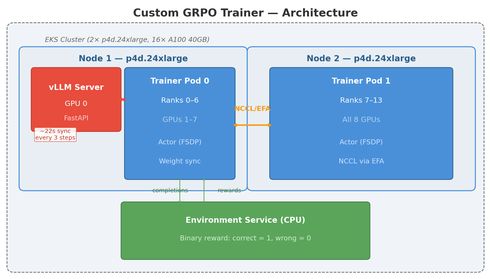
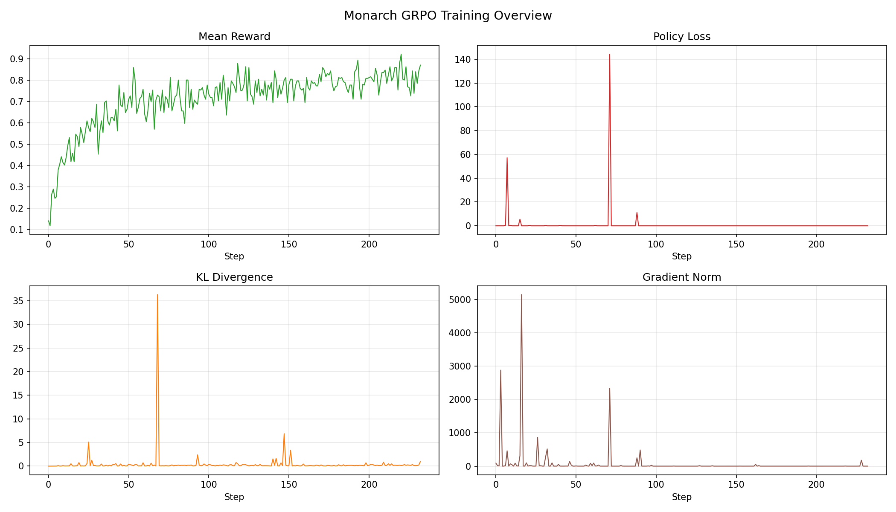

# The Result

Qwen2.5-1.5B: **14.5% → 87% accuracy** on grade-school math (GSM8K)

Three implementations, same model, same data, same cluster:

| Approach | Accuracy | Time | Architecture |
|---|---|---|---|
| Custom Trainer | ~60% reward | 26 hrs | Split: FSDP + vLLM pod |
| veRL (ByteDance) | **77%** | **35 min** | Colocated: all GPUs time-share |
| Monarch (Meta) | **87%** | 100 min | Split: FSDP actors + vLLM actor |

Infrastructure: EKS, 2× p4d.24xlarge (16× A100 40GB), Terraform

::: notes
This is the headline. We took the same small language model and trained it three different ways on the same hardware. The custom trainer was a learning exercise — it taught us how RL training works end-to-end but was too slow for production. veRL is a production framework by ByteDance that nails it in 35 minutes. Monarch is Meta's actor framework — we got it working from scratch, fixed 20+ issues, and matched veRL's training quality. The rest of this talk is about why these architectures matter and what we learned building on each one.
:::

# RL in 60 Seconds

**Supervised learning**: Here's the question AND the correct answer — learn to copy it.

**Reinforcement learning**: Here's the question — try something, I'll tell you if it worked.

The RL training loop:
```
repeat:
  1. Generate 256 attempts at math problems (8 attempts per problem)
  2. Check each answer: correct (reward=1) or wrong (reward=0)
  3. Compare within each group: which attempts were better?
  4. Update the model: do more of what worked, less of what didn't
```

No human-written solutions needed. Just: *did you get the right number?*

::: notes
Think of supervised learning as a cooking class where someone hands you the recipe. RL is more like being dropped in a kitchen — you try things, someone tastes the result and says "good" or "bad", and you figure out how to cook. For math, the reward is simple: extract the final number from the model's answer, check if it matches the ground truth. That's it. The model discovers its own reasoning strategies. GRPO is the specific RL algorithm from DeepSeek-R1 — it generates a group of attempts per problem and compares them to each other, no separate critic network needed.
:::

# The Infrastructure Challenge

Training an RL loop requires **four things running together**:

1. **Generator** — produces completions (needs fast inference, vLLM)
2. **Scorer** — checks if answers are correct (CPU, simple regex)
3. **Trainer** — updates model weights (needs FSDP across GPUs)
4. **Weight sync** — updated weights must reach the generator

The hard part: the generator and trainer need **different GPU configurations**. vLLM wants tensor parallelism. FSDP wants data parallelism. They fight over NCCL.

::: notes
This is the core infrastructure challenge that every RL training system must solve. The generator needs to be fast at producing text — vLLM is 10-100x faster than HuggingFace generate. The trainer needs FSDP to shard the model across GPUs for the backward pass. Both need GPUs but they configure them differently. In our custom trainer, we tried running both in the same process and they deadlocked on NCCL. That's what drives the architectural differences between the three approaches.
:::

# Three Architectures

{ width=100% }

**Custom**: vLLM in separate pod, HTTP weight sync (22s overhead)
**veRL**: All GPUs switch between roles — zero-copy weight resharding
**Monarch**: Dedicated actors on separate nodes — RDMA weight sync (aspirational), serialized RPC (current)

::: notes
The custom trainer puts vLLM in its own Kubernetes pod. Weight sync is HTTP — rank 0 serializes 3GB, POSTs it to vLLM. 22 seconds every 3 steps. Simple but slow.

veRL colocates everything on every GPU. During generation, FSDP is offloaded and vLLM takes over. During training, vLLM's KV cache is freed. Weights reshard in-place via DTensor — just a metadata operation, no data copy. This is why it's fast.

Monarch uses Meta's actor framework. The learner and generator are separate actors on different nodes. Clean separation of concerns, but weight sync across nodes is the bottleneck. We tried RDMA, gloo, FSx, and ended up with serialized RPC at 47 seconds per sync.
:::

# veRL: The Production Baseline (35 min)

Every GPU runs all roles by cycling through phases:

| Phase | Time | What happens |
|---|---|---|
| Generation | 19s | vLLM on all 16 GPUs, 2048 completions |
| Ref log probs | 5s | Frozen model from CPU, KL computation |
| Reward | 0.6s | CPU string matching |
| Training | 39s | FSDP forward + backward |
| **Total** | **70s/step** | **29 steps = 35 min for 1 epoch** |

Result: 14.5% → **77% accuracy** on GSM8K test set

::: notes
veRL is the gold standard. 29 steps, 35 minutes, done. The key insight is zero-cost weight sync — the model weights are already on the same GPUs, just resharded between FSDP layout and vLLM tensor-parallel layout. No network transfer at all. The frozen reference model lives on CPU and only moves to GPU briefly for KL computation. Each step processes 2048 completions — 256 prompts times 8 group size. The 7B model reached 88% accuracy in 83 minutes using the same setup.
:::

# Monarch: Building It from Scratch (20+ Issues)

What we had to solve to get FSDP training working in Monarch actors:

| Category | Issues | Key Fix |
|---|---|---|
| FSDP init | 5 | `setup_torch_elastic_env` + post-spawn `dist.init_process_group` |
| Memory | 4 | Micro-batching, activation checkpointing, CPU model loading |
| vLLM compat | 4 | `reload_weights`, `apply_model` pickle, flash-attn removal |
| Weight sync | 5 | Serialized RPC (6 approaches tried, 1 works) |
| Training quality | 3 | `kl_coef` 100x too high, detached KL, missing ref model |

Total debugging time: ~48 hours across 12 training runs

::: notes
Monarch has no FSDP example. We had to figure out every piece. The biggest issue was that proc_mesh.activate() is for Monarch's tensor engine, not NCCL — we needed setup_torch_elastic_env to set torchrun-style env vars, then dist.init_process_group in a post-spawn endpoint. HuggingFace's gradient_checkpointing_enable doesn't work with FSDP2 — had to use PyTorch's apply_activation_checkpointing. For weight sync, we tried RDMA (EFA doesn't support ibverbs RC queue pairs on p4d), gloo direct send (key mismatch corrupted weights), FSx shared filesystem (vLLM reload_weights corrupts model state), and NCCL gather reconstruction (wrong key namespace). Only serialized torch.save/load over Monarch RPC consistently works.
:::

# Monarch: The Result (100 min)

{ width=100% }

**14.5% → 87% reward** in one epoch (233 steps). Exceeds veRL's 77%.

But **3× slower**: 47 seconds of weight sync on every step.

::: notes
Run 12 was the breakthrough. The fix was kl_coef — we had 0.1, veRL uses 0.001. That 100x difference was strangling the model's ability to learn. Once we fixed it, the reward climbed from 14% to 87% in one epoch. The training quality actually exceeds veRL because we sync weights every step (fresh policy for every generation), while veRL's colocated approach is inherently synchronous. The cost is time — 47 seconds per weight sync via serialized RPC, which adds ~3 hours to the epoch. With RDMA weight sync working, this would drop to seconds.
:::

# Weight Sync: The Bottleneck

| Method | Speed | Status | Why it fails |
|---|---|---|---|
| Serialized RPC | **47s** | ✅ Works | Slow: torch.save → 3GB RPC → torch.load |
| Gloo send/recv | 27s | ❌ | FSDP `named_parameters()` ≠ `state_dict()` keys |
| FSx shared filesystem | 16s save | ❌ | vLLM `reload_weights` corrupts model state |
| RDMA (ibverbs) | — | ❌ | p4d EFA is Nitro v3: no RDMA read/write support |
| RDMA (OFI/libfabric) | — | ❌ | EFA provider: no `FI_RMA` caps, `fi_read` CQ never completes |
| RDMA (OFI messaging) | — | 🔧 WIP | Needs `fi_send/fi_recv` backend (like NCCL uses) |

**Root cause**: p4d is Nitro v3 → EFA hardware doesn't support RDMA read/write. P5+ (Nitro v4+) would work.

::: notes
We spent a significant amount of time trying to optimize weight sync. The serialized approach works but is painfully slow — it's 45% of total training time. We tried six different approaches. The gloo direct send was fast (27s) but had a subtle bug: FSDP's named_parameters returns different key names than state_dict, and vLLM's load_state_dict with strict=False silently ignores mismatched keys — zero weights loaded, model kept initial weights. The FSx approach saved weights to a shared Lustre filesystem, but vLLM's reload_weights internally mutates model_config.model, corrupting subsequent generation. For RDMA, we discovered p4d instances are Nitro v3 — EFA doesn't support fi_read/fi_write at the libfabric level. The EFA provider accepts the call but the completion queue never fires. NCCL works on EFA because it uses fi_send/fi_recv (messaging), not fi_read (RMA). This is the path forward for Monarch.
:::

# Infrastructure Stack

| Layer | Component | Details |
|---|---|---|
| **Compute** | 2× p4d.24xlarge | 16× A100 40GB, EFA 400Gbps |
| **Orchestration** | EKS 1.30 | Managed node groups, capacity blocks |
| **Training** | Monarch 0.5.x | MonarchMesh CRD, FSDP2, 8-rank learner |
| **Generation** | vLLM 0.19 | TP=4, in-process via Monarch actor |
| **Storage** | FSx Lustre | 1.2TB shared filesystem |
| **Networking** | EFA + NCCL | OFI plugin for all-gathers |
| **Monitoring** | Prometheus + Grafana | PodMonitor, auto-provisioned dashboards |
| **IaC** | Terraform | VPC, EKS, node groups, EFA, FSx, IRSA |

All code: `github.com/harishvs/rl_grpo_qwen_math`

::: notes
Everything is Infrastructure as Code. The Terraform modules manage the VPC, EKS cluster, GPU and CPU node groups with EFA, FSx Lustre filesystem, IAM roles for pod-level access (IRSA), and the EFA device plugin via Helm chart. The MonarchMesh CRD operator manages the GPU pods — 2 replicas, 8 GPUs each, with EFA interfaces. The training code, configs, and K8s manifests are all in the repo. We documented every issue we hit across 12 training runs. The EFA device plugin was originally installed as a manual DaemonSet missing /dev/infiniband mount — we replaced it with the official Helm chart following AWS docs.
:::

# Key Takeaways

1. **RL training quality is architecture-independent** — all three approaches reach 77-87% with correct hyperparameters

2. **Weight sync is the #1 infrastructure bottleneck** for split-placement RL — 45% of training time in Monarch vs 0% in veRL

3. **Colocated placement (veRL) is faster for small models** — zero-copy resharding beats any network transfer

4. **Split placement (Monarch) enables independent scaling** — scale generation and training separately. Matters more for 70B+ models

5. **EFA RDMA on p4d is messaging-only** — `fi_send/fi_recv` works (NCCL uses it), `fi_read/fi_write` doesn't. P5+ instances support full RDMA.

6. **Hyperparameters matter more than architecture** — `kl_coef` being 100× wrong (0.1 vs 0.001) was the difference between 24% and 87%

::: notes
If you take one thing from this talk: the infrastructure architecture doesn't limit training quality — it limits training speed. All three approaches converge to similar accuracy given enough time. The question is how fast you get there. For models that fit on 16 GPUs, veRL's colocated approach is strictly better — zero weight sync overhead, simpler deployment. For larger models where you want dedicated generation clusters and training clusters, Monarch's split placement is the right architecture — but you need fast weight sync. On p4d, that's currently limited to serialized RPC because EFA doesn't support RDMA read/write. On P5 instances with Nitro v4+, RDMA would close the gap. The kl_coef lesson is a reminder that debugging infrastructure for days doesn't help if the hyperparameters are wrong.
:::
