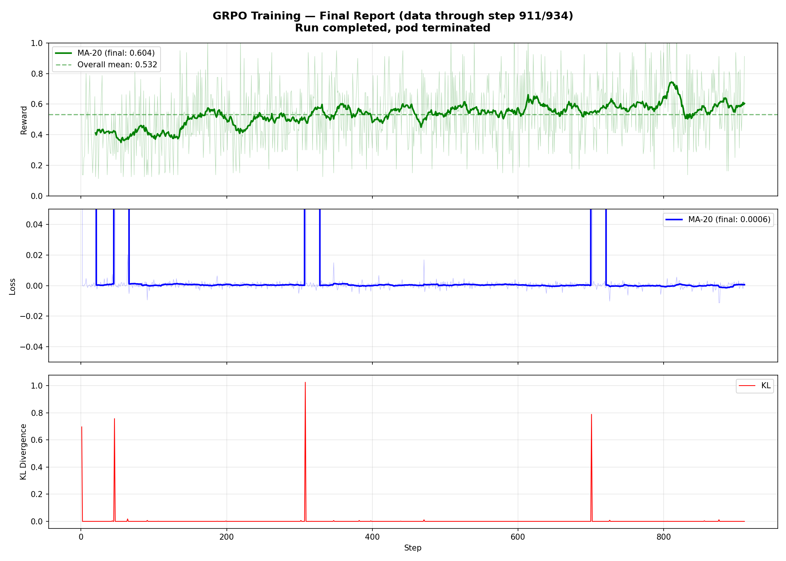

# Training Observations

## Run 3: 2026-02-18 (with FSDP checkpoint fix + KL clamp fix)

### Config
- Model: Qwen/Qwen2.5-1.5B
- batch_size=4, group_size=2, lr=1e-6, kl_coef=0.1, clip_range=0.2
- 8x A10 GPUs, FSDP FULL_SHARD, bf16

### Final Results — Steps 1-911+ (run completed ~2026-02-19 02:00 UTC)

**Run completed.** Pod terminated after finishing (or near-finishing) training. Last captured step was 911/934. Pod logs are no longer available — data below is from the last extraction at step 911. Checkpoints are on the EBS PVC (`grpo-checkpoints`).

**Reward — +19pp improvement, plateaued at ~0.59:**
| Steps | Avg Reward |
|-------|-----------|
| 1-100 | 0.4053 |
| 101-200 | 0.4879 |
| 201-400 | 0.5152 |
| 401-600 | 0.5504 |
| 601-800 | 0.5847 |
| 801-911 | 0.5912 |

- Starting reward (first 20 steps): 0.4113
- Final reward (last 20 steps): 0.6044
- Improvement: +0.1931 (+19 percentage points)
- Overall mean: 0.5324

**Loss:** Oscillated near zero throughout. 3 early spikes (steps 1/46/308) — all self-recovered, none after.

**KL:** 0.0000 for ~99% of steps. Clamped estimator was ineffective at lr=1e-6.

**Run duration:** ~22 hours on 1x g5.48xlarge (8x A10 GPUs).

**Verdict:** The model learned — reward climbed steadily from 0.40 to 0.59. But it plateaued in the last ~100 steps, limited by conservative hyperparameters (lr=1e-6, group_size=2) and code issues (mean log probs, clamped KL, format reward bonus). All of these are fixed for the next run.

### Post-Training Evaluation: GSM8K Test Set (100 problems)

| Model | Score | Accuracy |
|-------|-------|----------|
| Base (Qwen2.5-1.5B) | 40/100 | 40.0% |
| Trained (step 900) | 39/100 | 39.0% |
| Difference | -1 | -1.0pp |

**Training had zero measurable effect on test accuracy.** The -1pp difference is within noise.

The reward improvement during training (0.40 → 0.59) did not generalize to the held-out test set. The model's policy barely moved from the base — confirmed by KL=0.0000 for 99% of steps.

**Root causes (all fixed for next run):**
1. **Mean log probs** — importance ratio was computing per-token geometric mean, not sequence probability ratio. Clipping operated on the wrong quantity.
2. **Clamped KL = 0** — no regularization pressure. Schulman estimator will fix this.
3. **lr=1e-6 too low** — combined with mean log probs, weight updates were negligible.
4. **group_size=2** — advantage signal too noisy to learn generalizable patterns.

This serves as a clean baseline for the next run on p4de.24xlarge.

### Analysis: Why reward improvement is slow

Reward went from 0.40 → 0.58 over 500+ steps — real progress but slow. Contributing factors:

1. **Learning rate too conservative** — `1e-6` is on the low end. Most GRPO implementations use `1e-5` to `5e-5`. Each update barely nudges the weights.
2. **Group size 2 is small** — Only 2 completions per problem means noisy advantage signal. If both are correct or both wrong, advantage = 0 and the model learns nothing from that sample. Group size 4-8 gives much cleaner signal.
3. **No effective KL penalty** — Without KL pushback, the model has no pressure to commit to changes. Clipping alone is very conservative.
4. **Small batch size** — Batch 4 with gradient accumulation 4 = effective batch 16. Noisy gradients.

**Loss oscillating near zero is normal** for GRPO — it's a policy gradient loss, not a supervised loss. It measures "how much to push the policy this step," not "how wrong the model is." The metric that matters is reward.

**Recommendations for next run:**
- `learning_rate: 5e-6` (5x current)
- `group_size: 4` (if memory allows)
- Schulman KL estimator

---

## Lessons Learned

### 2026-02-17: FSDP Checkpoint Save/Load Bug

**What happened:** The training job failed on restart. It had completed 900 steps (~21 hours), but when resuming from the `step_900` checkpoint, the model loaded with randomly initialized weights.

**Root cause:** `ActorModel.save()` called `save_pretrained()` directly on the FSDP-wrapped model, which saves flattened `_flat_param` keys. On load, `from_pretrained()` expects standard HF keys, silently ignores `_flat_param`, and randomly initializes missing weights. No error raised — only a warning.

**Impact:**
- 900 steps (~21 hours) on 8x A10 GPUs lost
- All checkpoints (step_50 through step_900 and final) were corrupt
- Model silently trained from random weights after resume

**Fix:** Changed `save()` and `load()` to use `FSDP.state_dict_type(FULL_STATE_DICT)` to gather/unflatten params before saving.

**Mistakes during incident response:**
1. **Deleted all checkpoints including `final/`** — Cleanup used `rm -rf /checkpoints/step_*` but also wiped `final/`. Should have inspected contents first and kept backups of potentially recoverable data.
2. **Did not verify the fix before deploying** — Pushed the updated code to ECR and deployed without local validation. Should have tested the save→load cycle before burning GPU hours.

**Preventive measures:**
- Add checkpoint validation after save: reload and verify standard HF key names are present
- Assert on load that no weights were randomly initialized
- Log a hash of model weights at save/load to detect mismatches early

### 2026-02-17: KL Divergence Sign Bug

**What happened:** After restarting training, logs showed negative KL divergence values (e.g. `kl=-0.0030`, `kl=-0.0138`). KL divergence should always be ≥ 0.

**Root cause:** KL was computed as `(actor_log_probs - old_log_probs).mean()` — the raw log ratio, which can go negative. When used in the loss as `policy_loss + kl_coef * kl_div`, negative KL *rewards* divergence instead of penalizing it.

**Impact:**
- KL penalty was actively encouraging the policy to diverge from the reference
- Likely contributed to the loss spike at step 3 (`loss=70.7136, kl=0.8310`)

**Fix:** Clamped KL to be non-negative: `(actor_log_probs - old_log_probs).mean().clamp(min=0)`. This ensures the penalty is always a penalty, never a reward. However, the clamp results in KL=0 most of the time at low learning rates — Schulman estimator would be a better long-term fix.

---

## Next Run: p4de.24xlarge Plan (same model: Qwen2.5-1.5B)

### Hardware change
- From: g5.48xlarge — 8x A10 24GB (192GB total)
- To: p4de.24xlarge — 8x A100 80GB (640GB total)

### Proposed config changes
| Parameter | Current | Proposed | Reason |
|---|---|---|---|
| batch_size | 4 | 16 | 80GB per GPU gives ~3.3x headroom |
| group_size | 2 | 8 | DeepSeek-R1 recommended, much cleaner advantage signal |
| learning_rate | 1e-6 | 5e-6 | Current rate too conservative, no memory impact |
| gradient_accumulation_steps | 4 | 1 | Batch 16 is large enough, no need to accumulate |
| max_new_tokens | 512 | 1024 | Longer reasoning chains, more room to show work |
| KL estimator | clamp | Schulman | Proper non-negative KL without clamping artifacts |

### CloudWatch Embedded Metric Format (EMF) added
Added EMF emission to `MetricsLogger.log_step()` in `src/trainer/metrics.py`. On next deploy, CloudWatch will automatically extract `Reward`, `PolicyLoss`, `KLDivergence`, and `ClipFraction` as graphable metrics under the `RLCodeLLMTraining` namespace. This enables native CloudWatch dashboards and alarms without needing metric filters or a CloudWatch agent.

### Sequence-level log probs fix (mean → sum)
Fixed `ActorModel.compute_log_probs()`, `ReferenceModel.compute_log_probs()`, and `old_log_probs` collection to use `torch.sum()` instead of `torch.mean()` over token log probs. Using mean was incorrectly length-normalizing the log probs, which meant the importance ratio `π_new/π_old` in the clipped objective was computing a per-token geometric mean ratio rather than the true sequence probability ratio. This caused short and long responses to contribute equally to gradients regardless of length, and made the PPO clipping operate on the wrong quantity. Identified by comparing against Raschka's MEAP book (section 6.8).

### Schulman KL estimator
Replaced `(new - old).mean().clamp(min=0)` with the Schulman estimator `((ratio - 1) - log(ratio)).mean()`. The old formula was zero on 97% of steps because the naive difference was slightly negative (policy barely changed at lr=1e-6) and the clamp zeroed it out. The Schulman estimator is mathematically guaranteed non-negative without clamping and will produce meaningful non-zero values even with small policy changes, giving the KL penalty actual teeth.

### Binary reward function
Changed `RewardWorker.compute_reward()` from `correctness_score + format_score` (range 0.0-1.2) to strictly binary 1.0/0.0. The old format_score (up to 0.2 for reasoning indicators and answer markers) muddied the GRPO advantage signal — a wrong answer with good formatting (0.2) could get positive advantage if the group mean was below 0.2. With binary rewards, advantages cleanly split into positive (correct) and negative (wrong). This matches the DeepSeek-R1 approach, which found that training only on final-answer correctness works better than rewarding intermediate steps.

### Expected impact
- 16 problems × 8 completions = 128 completions per step (vs 8 currently)
- Total steps: ~234 (same data, bigger batches) vs 934 currently
- Step time: ~40-50s (faster GPUs + potential batched generation)
- Training time: ~3 hours vs ~20 hours
- Cost: ~$120 vs ~$330 (faster finish offsets higher hourly rate)
- Better advantage signal from group_size=8 should give faster, more stable reward improvement
