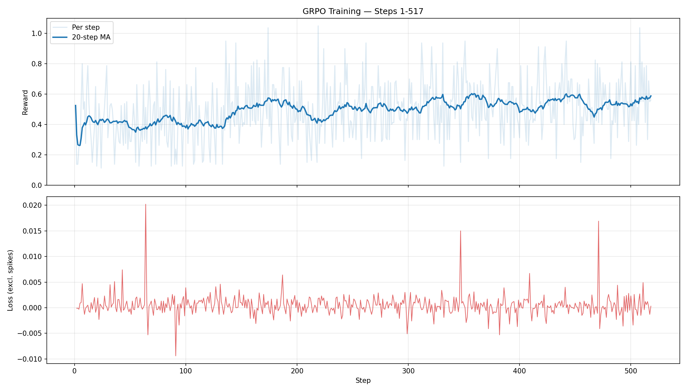
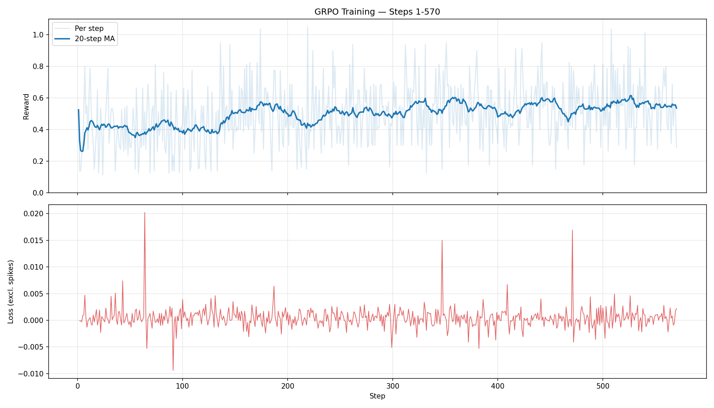

# Training Observations

## Run 3: 2026-02-18 (with FSDP checkpoint fix + KL clamp fix)

### Config
- Model: Qwen/Qwen2.5-1.5B
- batch_size=4, group_size=2, lr=1e-6, kl_coef=0.1, clip_range=0.2
- 8x A10 GPUs, FSDP FULL_SHARD, bf16

### Steps 1-570 (as of 2026-02-18 18:17 UTC)

**Reward — trending up:**
| Steps | Avg Reward |
|-------|-----------|
| 1-100 | 0.4052 |
| 101-200 | 0.4879 |
| 201-300 | 0.4877 |
| 301-400 | 0.5426 |
| 401-500 | 0.5426 |
| 501-570 | 0.5563 |

Overall avg: 0.5010. The model is learning — reward improved from 0.40 to 0.56 over 570 steps.

**Loss:** Oscillating near zero with three spikes:
- Step 1: loss=24.55, kl=0.70
- Step 46: loss=38.78, kl=0.76
- Step 308: loss=343.18, kl=1.03
- All recovered immediately on the next step. No new spikes since step 308.

**KL:** Still 0.0000 for ~99% of steps. The clamp + small learning rate means the penalty is almost always zero. Model is learning via policy gradient alone.

**Why KL is zero:** The KL estimator computes `(actor_log_probs - old_log_probs).mean().clamp(min=0)`. With learning rate 1e-6 and gradient accumulation over 4 steps, each weight update is tiny — the model's token probabilities barely change between generation time and the policy update. The log prob difference is a very small number that's roughly equally likely to be slightly positive or slightly negative due to floating point noise. The clamp zeros out the negative half, and the positive half rounds to 0.0000. The result: KL penalty contributes nothing to the loss, and the model trains on policy gradient alone. A Schulman KL estimator `((ratio - 1) - log(ratio))` would fix this since it's always positive regardless of direction, but training is progressing without it.

**Checkpoint:** Saves at step 50, 100, 150, ... all succeeding (unflattened FULL_STATE_DICT, 2.9GB each). Disk: 95GB available, ~55GB needed total.

**Status:** 55% complete, ~9 hours remaining. No crashes.

### Analysis: Why reward improvement is slow

Reward went from 0.40 → 0.58 over 500+ steps — real progress but slow. Contributing factors:

1. **Learning rate too conservative** — `1e-6` is on the low end. Most GRPO implementations use `1e-5` to `5e-5`. Each update barely nudges the weights.
2. **Group size 2 is small** — Only 2 completions per problem means noisy advantage signal. If both are correct or both wrong, advantage = 0 and the model learns nothing from that sample. Group size 4-8 gives much cleaner signal.
3. **No effective KL penalty** — Without KL pushback, the model has no pressure to commit to changes. Clipping alone is very conservative.
4. **Small batch size** — Batch 4 with gradient accumulation 4 = effective batch 16. Noisy gradients.

**Loss oscillating near zero is normal** for GRPO — it's a policy gradient loss, not a supervised loss. It measures "how much to push the policy this step," not "how wrong the model is." The metric that matters is reward.

**Recommendations for next run:**
- `learning_rate: 5e-6` (5x current)
- `group_size: 4` (if memory allows)
- Schulman KL estimator

---

## Lessons Learned

### 2026-02-17: FSDP Checkpoint Save/Load Bug

**What happened:** The training job failed on restart. It had completed 900 steps (~21 hours), but when resuming from the `step_900` checkpoint, the model loaded with randomly initialized weights.

**Root cause:** `ActorModel.save()` called `save_pretrained()` directly on the FSDP-wrapped model, which saves flattened `_flat_param` keys. On load, `from_pretrained()` expects standard HF keys, silently ignores `_flat_param`, and randomly initializes missing weights. No error raised — only a warning.

**Impact:**
- 900 steps (~21 hours) on 8x A10 GPUs lost
- All checkpoints (step_50 through step_900 and final) were corrupt
- Model silently trained from random weights after resume

**Fix:** Changed `save()` and `load()` to use `FSDP.state_dict_type(FULL_STATE_DICT)` to gather/unflatten params before saving.

**Mistakes during incident response:**
1. **Deleted all checkpoints including `final/`** — Cleanup used `rm -rf /checkpoints/step_*` but also wiped `final/`. Should have inspected contents first and kept backups of potentially recoverable data.
2. **Did not verify the fix before deploying** — Pushed the updated code to ECR and deployed without local validation. Should have tested the save→load cycle before burning GPU hours.

**Preventive measures:**
- Add checkpoint validation after save: reload and verify standard HF key names are present
- Assert on load that no weights were randomly initialized
- Log a hash of model weights at save/load to detect mismatches early

### 2026-02-17: KL Divergence Sign Bug

**What happened:** After restarting training, logs showed negative KL divergence values (e.g. `kl=-0.0030`, `kl=-0.0138`). KL divergence should always be ≥ 0.

**Root cause:** KL was computed as `(actor_log_probs - old_log_probs).mean()` — the raw log ratio, which can go negative. When used in the loss as `policy_loss + kl_coef * kl_div`, negative KL *rewards* divergence instead of penalizing it.

**Impact:**
- KL penalty was actively encouraging the policy to diverge from the reference
- Likely contributed to the loss spike at step 3 (`loss=70.7136, kl=0.8310`)

**Fix:** Clamped KL to be non-negative: `(actor_log_probs - old_log_probs).mean().clamp(min=0)`. This ensures the penalty is always a penalty, never a reward. However, the clamp results in KL=0 most of the time at low learning rates — Schulman estimator would be a better long-term fix.
