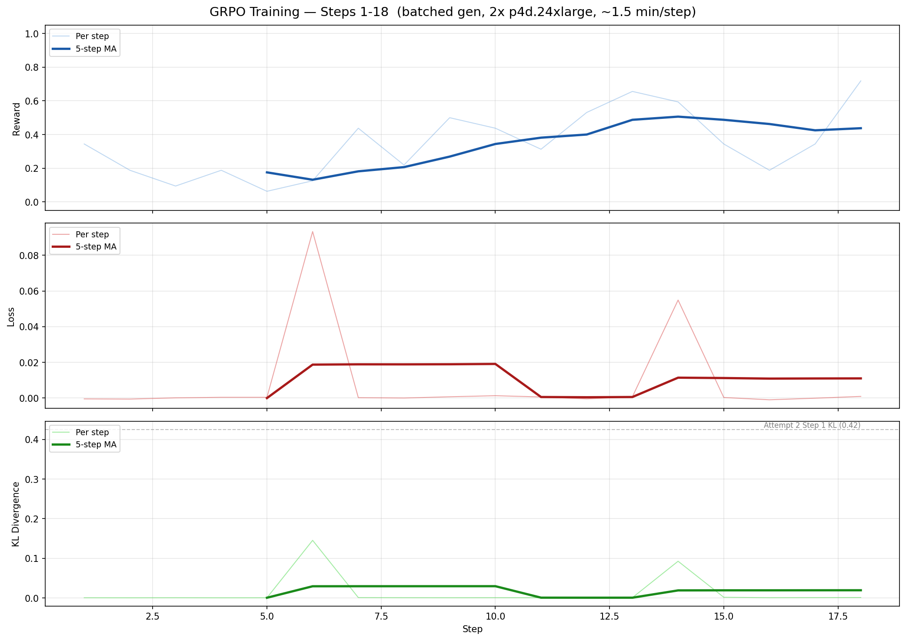

# Run 2026-02-19: Multi-Node GRPO Training on 2x p4d.24xlarge

## Infrastructure
- **Cluster**: `rl-code-llm-training-dev`, EKS 1.29, us-east-1
- **GPU Nodes**: 2x p4d.24xlarge (8x A100 40GB each, 16 GPUs total)
- **AMI**: AL2023_x86_64_NVIDIA
- **Capacity Block**: `cr-REDACTED` (active 2026-02-19 06:33 UTC → 2026-02-21 11:30 UTC)
- **EFA**: 4 interfaces per node (1 per network card), EFA security group + cluster SG
- **CPU Nodes**: 2x AL2023_x86_64_STANDARD
- **Storage**: emptyDir (FSx Lustre client 2.15.6 incompatible with FSx 2.10 filesystem)
- **Training**: Multi-node torchrun via k8s IndexedJob (2 pods, headless service for rendezvous)

## Code Fixes Applied (vs Run 2026-02-18)
1. **Sequence-level log probs**: `mean()` → `sum()` in 3 locations in `trainer.py`
2. **Schulman KL estimator**: `((ratio - 1) - log(ratio)).mean()` replacing clamped naive difference
3. **Binary reward**: Strictly 1.0/0.0 in `reward.py`
4. **CloudWatch EMF metrics**: `_emit_emf()` in `metrics.py`

## Hyperparameters
| Parameter | Value | Change from Run 2026-02-18 |
|---|---|---|
| model_name | Qwen/Qwen2.5-1.5B | same |
| batch_size | 4 | same |
| group_size | 8 | was 2 |
| learning_rate | 5e-6 | was 1e-6 |
| num_epochs | 1 | same |
| kl_coef | 0.1 | same |
| clip_range | 0.2 | same |
| max_new_tokens | 1024 | was 512 |
| max_samples | 7473 | was 3736 |
| max_grad_norm | 1.0 | new |
| checkpoint_interval | 50 | was 100 |
| FSDP world_size | 16 | was 8 |

## Infrastructure Issues Resolved
1. **EFA interface layout**: p4d.24xlarge has 4 network cards with 1 EFA each (not 4 EFA on card 0). Fixed `network_card_index` in launch template.
2. **Security group**: GPU nodes had only EFA SG — needed EKS-managed cluster SG (`sg-REDACTED`) for API server connectivity. The Terraform EKS module was outputting the custom cluster SG instead of the EKS-managed one.
3. **FSx Lustre mount failure**: AL2023 NVIDIA AMI ships Lustre client 2.15.6, incompatible with FSx Lustre 2.10 filesystem. Error: `The client profile '4z23vamv-client' could not be read from the MGS`. Fell back to emptyDir.
4. **CPU AMI**: Updated from AL2 to `AL2023_x86_64_STANDARD`.
5. **Console access**: Added `HarishAdminRole` as EKS access entry with cluster admin policy (switched auth mode to `API_AND_CONFIG_MAP`).

## Training Attempt 1: batch_size=8 (OOM)
- **Config**: batch_size=8, group_size=8 → 64 sequences/step
- **Result**: OOM on GPU 0 immediately during step 1
- **Error**: `CUDA out of memory. Tried to allocate 20.00 MiB. GPU 0 has a total capacity of 39.49 GiB of which 11.44 MiB is free.`
- **Cause**: Rank 0 holds FSDP shard + full generation model (~3GB). 64 sequences too many for 40GB.

## Training Attempt 2: batch_size=4
- **Config**: batch_size=4, group_size=8 → 32 sequences/step
- **Started**: 2026-02-19 08:22:03 UTC
- **Crashed**: 2026-02-19 08:33:38 UTC (after ~11 minutes, 2 steps)
- **Job status**: BackoffLimitExceeded at 08:49:43 UTC

### Training Steps
| Step | Loss | Reward | KL | Notes |
|------|------|--------|-----|-------|
| 1 | 0.1358 | 0.4062 | 0.4249 | Healthy — 40.6% reward matches base model |
| 2 | 254.3153 | 0.2812 | 194.8076 | **KL EXPLODED** — loss and KL diverged catastrophically |

### Crash Analysis
- After step 2, the model weights diverged (KL went from 0.42 → 194.8 in one step)
- Step 3 crashed with OOM in `compute_log_probs` → `self._model(**inputs)` — likely NaN/inf activations consuming unbounded memory
- **Root cause**: The Schulman KL estimator `((ratio - 1) - log(ratio))` combined with sequence-level `sum()` log probs produces enormous KL values. With `sum()` instead of `mean()`, the log prob magnitudes are much larger (proportional to sequence length), making the importance ratio `exp(new_log_prob - old_log_prob)` explode.

### Likely Fix Needed
The `sum()` fix for log probs is correct for the policy gradient, but the KL computation and importance ratio may need to account for the scale change:
- Option A: Use per-token mean for KL, sum for policy gradient
- Option B: Reduce learning rate further (5e-6 may be too high with sum log probs)
- Option C: Clamp the importance ratio more aggressively
- Option D: Reduce kl_coef since KL values are now much larger with sum

## Fix Applied: Per-Token Importance Ratio and KL (2026-02-19 ~10:50 UTC)

### Diagnosis
The root cause was computing the importance ratio on **sequence-level summed** log probs. With sequences of 100-1000 tokens, even tiny per-token log prob shifts (0.01) accumulate into large sums, and `exp(sum)` explodes exponentially:

```
# Broken: sequence-level
old_sum = sum of 200 token log probs = -450.0
new_sum = -448.0  (each token shifted by ~0.01)
ratio = exp(-448 - (-450)) = exp(2.0) = 7.4   ← already unstable
# After one gradient step with large ratio, next step gets exp(50) = 5×10²¹

# Fixed: per-token
ratio_per_token = exp(0.01) = 1.01   ← perfectly stable
```

The DeepSeek R1 paper (equation 2) and the "Build a Reasoning Model from Scratch" book both confirm: the importance ratio `π_new(token)/π_old(token)` is a **per-token** concept. PPO/GRPO clipping must operate per-token, then average.

### Changes to `src/trainer/trainer.py`

**1. `ActorModel.compute_log_probs`** — returns `List[torch.Tensor]` (per-token log probs for each rollout) instead of `torch.Tensor` (one summed scalar per rollout). Removed the `.sum()` aggregation.

**2. `ReferenceModel.compute_log_probs`** — same change for consistency.

**3. `train_step`** — keeps `old_log_probs_per_token` as list of per-token tensors from rollout generation (no longer sums `r.log_probs`). Computes KL per-token using Schulman estimator `((r - 1) - log(r))`, averages within each sequence, then averages across sequences.

**4. `_update_policy`** — computes per-token importance ratio `exp(new_lp_i - old_lp_i)`, applies PPO clipping per-token, averages loss over tokens within each sequence, then averages across sequences.

### Numerical Verification
Simulated 200-token sequence with per-token shift of 0.02 std:
- Old (sequence-level): ratio=1.46, KL=0.0816
- New (per-token): mean ratio=1.002, KL=0.000190
- Per-token ratios range 0.96–1.06 — well within clip range of [0.8, 1.2]

## TODO
- [x] ~~Rebuild trainer Docker image with per-token fix~~
- [x] ~~Delete failed job and relaunch training~~
- [x] ~~Monitor for stable KL through first 10+ steps before leaving unattended~~
- [x] ~~Speed up generation: batched HF generate with num_return_sequences~~
- [ ] Investigate FSx Lustre 2.10 vs 2.15.6 client compatibility for shared checkpoints
- [ ] Investigate KL spikes at steps 6 and 14 (micro-batch gradient scaling)
- [ ] vLLM as separate server process for further generation speedup
- [ ] Regenerate progress chart at step 50+ and 100+

## Training Attempt 3: Per-Token Fix + Gradient Accumulation (RUNNING)

### OOM on First Per-Token Attempt
After applying the per-token fix, the first relaunch (attempt 3a) completed 2 steps with stable KL (0.0008) but OOM'd on step 3 backward pass. The per-token approach keeps more tensors in the computation graph (one per token per rollout vs one scalar per rollout), increasing peak memory during backward.

Error: `CUDA out of memory. Tried to allocate 28.00 MiB. GPU 0 has 39.49 GiB total, 38.51 GiB allocated by PyTorch.`

### Gradient Accumulation Fix
Rewrote `_update_policy` to process one rollout at a time with gradient accumulation instead of building one huge computation graph for all 32 rollouts:
- Forward pass → compute per-token loss → `.backward()` → free graph → next rollout
- Each rollout's loss scaled by `1/n_rollouts` for proper averaging
- KL computed per-token with detached tensors (no extra graph memory)

Also added `--tee=3 --local_ranks_filter=0` to torchrun for proper log visibility in `kubectl logs`.

### Training Progress
- **Started**: 2026-02-19 19:19:44 UTC
- **Status**: Running (no restarts, no OOM)
- **Step time**: ~5 min/step (~12 steps/hour)

| Step | Loss | Reward | KL | Time (UTC) |
|------|------|--------|-----|------------|
| 1 | 0.0006 | 0.4375 | 0.0007 | 19:24:08 |
| 2 | 0.0006 | 0.1875 | 0.0004 | 19:29:10 |
| 3 | -0.0001 | 0.0312 | 0.0007 | 19:34:33 |
| 4 | -0.0002 | 0.1250 | 0.0005 | 19:39:23 |
| 5 | -0.0002 | 0.0938 | 0.0006 | 19:44:36 |
| 6 | 0.0000 | 0.5000 | 0.0006 | 19:49:06 |
| 7 | -0.0011 | 0.4375 | 0.0009 | 19:54:12 |
| 8 | -0.0001 | 0.1875 | 0.0006 | 19:59:06 |

### Training Progress Charts

#### Reward (higher = better)
```
    0.5000 │ ·  ·  ·  ·  ·  ●  ·  · 
           │ ·  ·  ·  ·  ·  ●  ·  · 
           │ ●  ·  ·  ·  ·  ●  ●  · 
           │ ●  ·  ·  ·  ·  ●  ●  · 
           │ ●  ·  ·  ·  ·  ●  ●  · 
    0.2656 │ ●  ·  ·  ·  ·  ●  ●  · 
           │ ●  ·  ·  ·  ·  ●  ●  · 
           │ ●  ●  ·  ·  ·  ●  ●  ● 
           │ ●  ●  ·  ●  ·  ●  ●  ● 
           │ ●  ●  ·  ●  ●  ●  ●  ● 
    0.0312 │ ·  ·  ●  ·  ·  ·  ·  · 
           └────────────────────────
             S1  S2  S3  S4  S5  S6  S7  S8 
```

#### Loss
```
    0.0006 │ ●  ●  ·  ·  ·  ·  ·  · 
           │ ●  ●  ·  ·  ·  ·  ·  · 
           │ ●  ●  ·  ·  ·  ·  ·  · 
           │ ●  ●  ·  ·  ·  ·  ·  · 
           │ ●  ●  ·  ·  ·  ●  ·  · 
   -0.0003 │ ●  ●  ●  ●  ●  ●  ·  ● 
           │ ●  ●  ●  ●  ●  ●  ·  ● 
           │ ●  ●  ●  ●  ●  ●  ·  ● 
           │ ●  ●  ●  ●  ●  ●  ·  ● 
           │ ●  ●  ●  ●  ●  ●  ·  ● 
   -0.0011 │ ·  ·  ·  ·  ·  ·  ●  · 
           └────────────────────────
             S1  S2  S3  S4  S5  S6  S7  S8 
```

#### KL Divergence (should stay small and stable)
```
    0.0009 │ ·  ·  ·  ·  ·  ·  ●  · 
           │ ·  ·  ·  ·  ·  ·  ●  · 
           │ ·  ·  ·  ·  ·  ·  ●  · 
           │ ·  ·  ·  ·  ·  ·  ●  · 
           │ ●  ·  ●  ·  ·  ·  ●  · 
    0.0006 │ ●  ·  ●  ·  ·  ·  ●  · 
           │ ●  ·  ●  ·  ·  ·  ●  · 
           │ ●  ·  ●  ·  ●  ●  ●  ● 
           │ ●  ·  ●  ·  ●  ●  ●  ● 
           │ ●  ·  ●  ●  ●  ●  ●  ● 
    0.0004 │ ·  ●  ·  ·  ·  ·  ·  · 
           └────────────────────────
             S1  S2  S3  S4  S5  S6  S7  S8 
```

### Summary Statistics (Steps 1-8)
- Mean reward: 0.2500
- Mean KL: 0.000625 (vs 194.8 in attempt 2 — per-token fix working)
- Mean loss: -0.000063
- Max KL: 0.000900
- Reward range: 0.0312 – 0.5000
- Avg step time: ~5 min
- Steps/hour: ~12

### Observations
1. **KL is stable**: Range 0.0004–0.0009 across all 8 steps. Compare to attempt 2 where KL exploded to 194.8 on step 2. The per-token fix completely resolved the KL explosion.
2. **Reward is noisy**: Varies 3%–50% per step, which is expected with batch_size=4 (only 4 problems per step, high variance). No clear upward trend yet — need more steps.
3. **Loss is near zero**: Small negative values indicate the policy is slightly improving, but the signal is weak. This is expected early in training with small per-token ratios.
4. **No OOM**: Gradient accumulation resolved the memory issue. Zero restarts.
5. **Speed concern**: At ~5 min/step and 1868 total steps, full training would take ~156 hours. Capacity block expires in ~32 hours (2026-02-21 11:30 UTC). Will complete ~384 steps (~20% of dataset).

### Comparison: Attempt 2 vs Attempt 3
| Metric | Attempt 2 (broken) | Attempt 3 (fixed) |
|--------|-------------------|-------------------|
| Step 1 KL | 0.4249 | 0.0007 |
| Step 2 KL | 194.8076 | 0.0004 |
| Step 3 | OOM crash | 0.0007 (stable) |
| Steps completed | 2 | 12 (OOM on grad accum attempt) |
| Ratio scale | exp(sum) → huge | exp(per-token) → ~1.0 |

## Training Attempt 4: Batched Generation (RUNNING)

### Speed Optimization Journey
1. **Attempt 3** (1 rollout/forward pass): ~5 min/step → 12 steps/hr — too slow (156h for full dataset)
2. **Attempt 3b** (micro-batch 8 rollouts/pass): ~3.5 min/step → 17 steps/hr — better but still 110h
3. **vLLM attempt**: vLLM `LLM` class hangs inside torchrun — can't coexist with FSDP/NCCL in same process (both v0 and v1 engines deadlock during init)
4. **Attempt 4** (batched HF generate): `num_return_sequences=group_size` → 4 generate calls instead of 32 → **~1.5 min/step → 40 steps/hr**

### Why vLLM Failed
vLLM's `LLM` class spawns its own engine process (v1) or creates its own CUDA context (v0). Inside a torchrun worker that already has CUDA initialized and NCCL process groups, this causes a deadlock during vLLM initialization. Would need a separate vLLM server process (architectural change) to work.

### Batched Generation Fix
Changed `generate_rollouts` to use `num_return_sequences=group_size` in HuggingFace `model.generate()`. Instead of 32 sequential generate calls (1 completion each), now makes 4 calls (1 per prompt, 8 completions each). The KV cache is shared across the group, so this is much more efficient.

### Training Progress
- **Started**: 2026-02-19 21:19:46 UTC
- **Status**: Running (no restarts, no OOM)
- **Step time**: ~1.5 min/step (~40 steps/hr)
- **Projected**: 1868 steps × 1.5 min = ~47h (capacity block has ~28h left → ~1120 steps / 60%)

| Step | Loss | Reward | KL | Time (UTC) |
|------|------|--------|-----|------------|
| 1 | -0.0005 | 0.3438 | 0.0006 | 21:19:46 |
| 2 | -0.0006 | 0.1875 | 0.0005 | 21:21:13 |
| 3 | 0.0001 | 0.0938 | 0.0007 | 21:22:53 |
| 4 | 0.0004 | 0.1875 | 0.0005 | 21:24:26 |
| 5 | 0.0004 | 0.0625 | 0.0006 | 21:26:03 |
| 6 | 0.0933 | 0.1250 | 0.1454 | 21:27:34 |
| 7 | 0.0002 | 0.4375 | 0.0010 | 21:29:04 |
| 8 | -0.0000 | 0.2188 | 0.0008 | 21:30:38 |
| 9 | 0.0007 | 0.5000 | 0.0007 | 21:31:59 |
| 10 | 0.0013 | 0.4375 | 0.0008 | 21:33:40 |
| 11 | 0.0006 | 0.3125 | 0.0007 | 21:35:08 |
| 12 | -0.0005 | 0.5312 | 0.0005 | 21:36:42 |
| 13 | 0.0007 | 0.6562 | 0.0009 | 21:38:18 |
| 14 | 0.0549 | 0.5938 | 0.0927 | 21:39:55 |
| 15 | 0.0003 | 0.3438 | 0.0018 | 21:41:24 |
| 16 | -0.0010 | 0.1875 | 0.0008 | 21:42:47 |
| 17 | -0.0001 | 0.3438 | 0.0010 | 21:44:22 |
| 18 | 0.0009 | 0.7188 | 0.0012 | 21:46:00 |

### Training Progress Chart


### Summary Statistics (Steps 1-18)
- Mean reward: 0.3403
- Mean KL: 0.0141 (0.0008 excluding 2 spikes)
- Max reward: 0.7188 (step 18)
- Avg step time: 1m 33s
- Steps/hour: ~40
- KL spikes at steps 6 and 14 self-corrected within 1 step

### Observations
1. **KL stable**: Excluding 2 transient spikes (steps 6 and 14), KL stays in 0.0005–0.0018 range. Spikes self-correct immediately — the clipping mechanism works.
2. **Reward trending up**: 5-step MA shows upward trend from ~0.15 to ~0.45. Step 18 hit 0.72 — highest yet.
3. **Speed**: 3x faster than attempt 3 (1.5 min vs 5 min/step). Batched `num_return_sequences` was the key win.
4. **KL spikes**: Likely caused by micro-batch gradient scaling — the loss division `/ (n_rollouts / len(mb_losses))` may over-weight some micro-batches. Not critical since they self-correct.

### Speed Comparison Across Attempts
| Attempt | Generation | Policy Update | Step Time | Steps/hr |
|---------|-----------|---------------|-----------|----------|
| 2 (crashed) | 32 seq HF generate | 1 backward (all 32) | ~4 min | ~15 |
| 3 (OOM fix) | 32 seq HF generate | 32 backward (1 each) | ~5 min | ~12 |
| 3b (micro-batch) | 32 seq HF generate | 4 backward (8 each) | ~3.5 min | ~17 |
| 4 (batched gen) | 4 batched HF generate | 4 backward (8 each) | ~1.5 min | ~40 |
| (vLLM, failed) | would be 1 batched call | — | — | — |

## Training Attempt 5: vLLM Server + HTTP Weight Sync

### Architecture Change
Deployed vLLM as a **separate Kubernetes pod** (not inside torchrun) to avoid the NCCL/CUDA deadlock from attempt 4's failed vLLM integration. Architecture:

- **vLLM server pod**: 1 GPU, runs FastAPI server wrapping `vllm.LLM`
  - `POST /generate` — batch generation with per-token log probs
  - `POST /update_weights` — receives serialized state_dict, updates model in-place
  - `GET /health` — health check
- **Trainer pods**: 7 GPUs each (14 total FSDP), HTTP client to vLLM server
  - Rank 0 calls vLLM for generation, broadcasts rollouts to all ranks
  - After training step, rank 0 pushes weights via HTTP POST

### Issues Encountered & Fixed

1. **vLLM v1 `model_executor` AttributeError**: v1 engine doesn't expose `model_executor.driver_worker.model_runner.model`. Fixed by using `LLM.apply_model()` API with a module-level function.

2. **`apply_model` serialization error**: v1 engine tries to pickle the function passed to `apply_model`. Closures capturing `state_dict` aren't serializable. Fixed with `VLLM_ALLOW_INSECURE_SERIALIZATION=1` + module-level function + global `_pending_state_dict`.

3. **GPU OOM on weight update**: `torch.load(buf, map_location="cuda:0")` loaded the full 3GB state dict onto GPU that already had vLLM model + KV cache (~37GB used of 40GB). Fixed by loading to CPU (`map_location="cpu"`) and copying params one at a time via `model_params[name].data.copy_(new_param)`.

4. **vLLM server restarts crashing trainer**: When vLLM server restarted, trainer's `/generate` call got `ConnectionRefused` and crashed (no retry). Fixed by adding retry loop (30 attempts, 10s apart) for `ConnectionError`/`Timeout`.

5. **Checkpoint save crash at step 50** ← ROOT CAUSE OF POD DEATH: `save_checkpoint` used `self._local_rank == 0` to decide which rank saves. With `rank0_only=True` FSDP state dict config, only global rank 0 gets the full state dict. Node 1's `local_rank 0` (global rank 7) received an empty dict → `Missing key(s) in state_dict for Qwen2ForCausalLM` → crash → node 0 hung on NCCL collective → SIGTERM. **Fixed**: `self._rank == 0` instead of `self._local_rank == 0`.

6. **torchrun rendezvous race**: Non-master node starts before master, connects to stale TCPStore. Fixed with dynamic wait loop in `entrypoint.sh` polling master's rendezvous port.

### Weight Sync Performance
| Phase | Time |
|-------|------|
| `state_dict()` (FSDP summon) | ~0s (already summoned) |
| `torch.save` serialization | ~4.3s |
| HTTP transfer (3GB) | ~5s |
| Server-side `torch.load` + param copy | ~13s |
| **Total** | **~22s** |

Weight sync runs every 3 steps to amortize overhead. KL spikes on non-sync steps (up to 25.8 on step 19) but self-corrects after next sync.

### Training Progress (49 steps before checkpoint crash)
- **Started**: 2026-02-20 01:48 UTC
- **Crashed**: 2026-02-20 02:48 UTC (step 50 checkpoint save bug)
- **Step time**: ~55s without sync, ~78s with sync, avg ~63s/step
- **Steps/hr**: ~57

| Step | Reward | KL | Notes |
|------|--------|-----|-------|
| 1 | 0.3125 | 0.0007 | Post-sync, healthy |
| 2 | 0.1875 | 10.98 | No sync, KL spike |
| 7 | 0.4062 | 0.0063 | Post-sync |
| 9 | 0.5625 | 0.0110 | |
| 12 | 0.5625 | 0.0031 | |
| 18 | 0.5312 | 0.0027 | |
| 19 | 0.5000 | 25.81 | KL spike (no sync) |
| 25 | 0.3125 | 0.0029 | |
| 45 | 0.4375 | 0.0288 | |
| 49 | 0.3750 | 0.2668 | Last step before crash |

### Speed Comparison (Updated)
| Attempt | Generation | Step Time | Steps/hr |
|---------|-----------|-----------|----------|
| 3 (HF sequential) | 32 seq HF generate | ~5 min | ~12 |
| 4 (HF batched) | 4 batched HF generate | ~1.5 min | ~40 |
| 5 (vLLM server) | 1 HTTP call to vLLM | ~63s avg | ~57 |

### Batched compute_log_probs Optimization

**Problem**: `ActorModel.compute_log_probs()` ran a separate FSDP forward pass for each rollout sequentially — 32 forward passes per step, each triggering all-gather across 14 ranks. This was the dominant cost (~32s of the ~55s step time).

**Fix**: Batch-tokenize rollouts with padding, run a single forward pass per micro-batch. Micro-batch size = 4 (conservative to avoid OOM). Reduces 32 sequential forward passes to 8 batched ones.

**Result**:
| Metric | Before (sequential) | After (batched, mb=4) |
|--------|--------------------|-----------------------|
| Step time (no sync) | ~55s | ~42s |
| Step time (with sync) | ~78s | ~65s |
| Blended avg (sync every 3) | ~63s | ~50s |
| Steps/hr | ~57 | ~72 |
