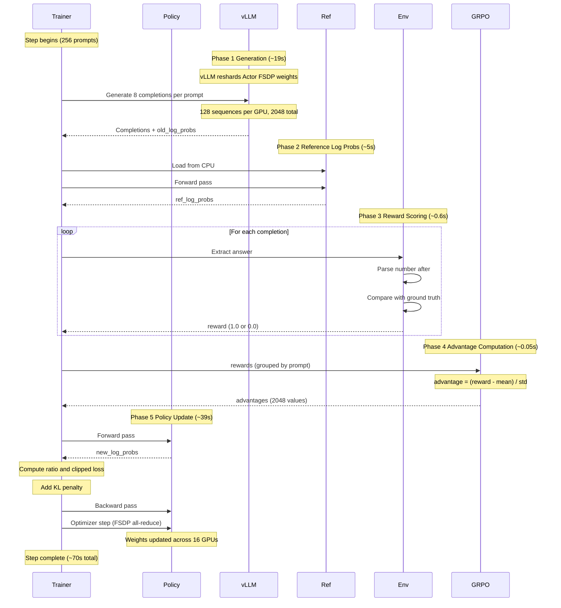

# veRL RL Loop Sequence Diagram

## Phase Breakdown

| Phase | Duration | Description |
|-------|----------|-------------|
| 1. Generation | ~19s | vLLM generates 8 completions per prompt (2,048 sequences total) |
| 2. Reference Log Probs | ~5s | Reference model computes log probs for KL penalty |
| 3. Reward Scoring | ~0.6s | Binary correctness check (1.0 or 0.0) |
| 4. Advantage Computation | ~0.05s | Group-relative normalization (GRPO) |
| 5. Policy Update | ~39s | Forward + backward pass with clipped gradients |
| **Total** | **~70s** | **2,048 sequences processed** |

## Key Differences from Custom Trainer

- **Colocated architecture**: All components run on the same GPUs, switching phases
- **Zero-copy weight sync**: vLLM directly accesses Actor weights (no HTTP transfer)
- **Massive batch size**: 256 prompts × 8 completions = 2,048 sequences/step (vs 32 in custom)
- **Full reference model**: CPU-offloaded for proper KL computation (custom trainer skipped this)
- **Throughput**: 104,448 sequences/hour (45x faster than custom trainer)
